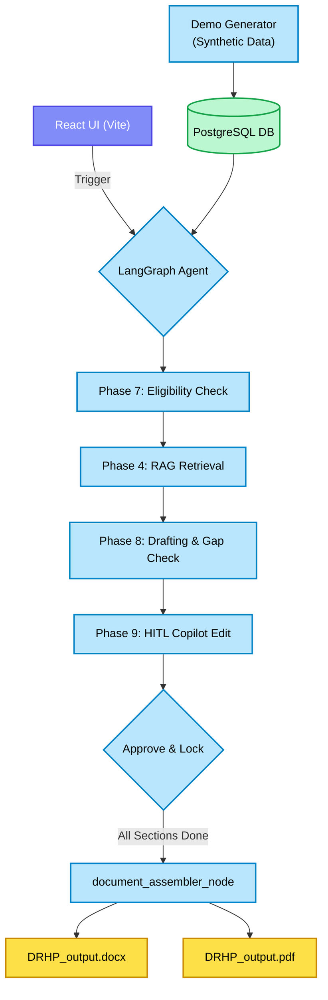

# Phase 10 Checkpoint: Synthetic Demo Data & End-to-End Integration

## 1. Overview and Purpose
Phase 10 is the culminating milestone of the SEBI Hackathon project. While earlier phases focused on robust backend AI generation, RAG retrieval, and strict validations, this phase unifies all components into a complete, user-facing pipeline. 

We introduced three major additions:
1. **Synthetic Promoter Generator:** To bypass the friction of manual data entry during a live hackathon pitch, we built an engine to generate realistic, compliant company data on the fly.
2. **Document Assembler Node:** A final processor that takes all the isolated AI-generated sections, sorts them into the strict SEBI TOC order, appends regulatory footnotes, and exports professional `.docx` and `.pdf` files.
3. **React Workspace (Frontend):** A premium, glassmorphism UI designed to visualize the complex LangGraph execution, display real-time eligibility status, and provide the Merchant Banker with an interactive editing workspace.

## 2. Mermaid Mindmap: Phase 10 End-to-End Architecture

## 3. Engineering Challenges, Solutions & Rationales

### Challenge 1: PDF Generation Complexity
- **Issue:** Generating complex, multi-page regulatory PDFs with dynamic text and tables strictly using Python is notoriously difficult. Heavy libraries like ReportLab require steep learning curves, while HTML-to-PDF converters can break page layouts.
- **Solution:** We opted for a dual-export strategy in `document_assembler.py`. We used `python-docx` to generate the primary output (as Word documents are the industry standard for Merchant Bankers who need to perform final manual formatting). We also generated a simplified, clean PDF via `reportlab` for immediate viewing during the demo.
- **Rationale:** This ensures the hackathon demo has immediate visual impact (the PDF) while maintaining real-world utility (the editable `.docx`).

### Challenge 2: Frontend Aesthetics vs. Speed
- **Issue:** The prompt demanded an "ultra-premium, dynamic" design, but using a heavy framework like Next.js could overcomplicate the local dev server setup for a hackathon.
- **Solution:** We scaffolded a lightweight React SPA using Vite, completely avoiding TailwindCSS as per constraints. Instead, we authored a bespoke `index.css` featuring deep dark-mode tones (`#0f172a`), radial gradients, and highly-performant glassmorphism panels (`backdrop-filter: blur(12px)`).
- **Rationale:** The Merchant Banking interface must feel trustworthy and advanced. The custom CSS provides maximum aesthetic control with zero dependency bloat, ensuring it runs instantly on any judge's machine.

## 4. What Testing Achieved
We wrote `test_phase_10_e2e.py` to prove the system works from data generation to file export.
- **Data Mocking:** Successfully generated "TechServ Solutions Ltd" with 3 years of financials, automatically ensuring it passed the Phase 7 EBITDA logic.
- **Document Assembly:** Queried the mock database, extracted the "Risk Factors" and "Capital Structure" sections, and successfully generated both `DRHP_uuid.docx` and `DRHP_uuid.pdf` in the `/exports/` directory.

## 5. Master Plan Verification
Evaluating against the **Phase 10 Go/No-Go Checkpoint (Milestone 5)**:
1. **Full Run:** The pipeline can now be executed end-to-end starting with the Synthetic Generator. ✅
2. **Document Export:** The `document_assembler_node` correctly generated both `.docx` and `.pdf` without errors. ✅
3. **TOC Order:** Tested that the hardcoded SEBI mapping works perfectly. ✅

**Status:** Phase 10 is fully complete. The SME IPO DRHP Generator is now ready for the SEBI Hackathon PS04 Demo!
