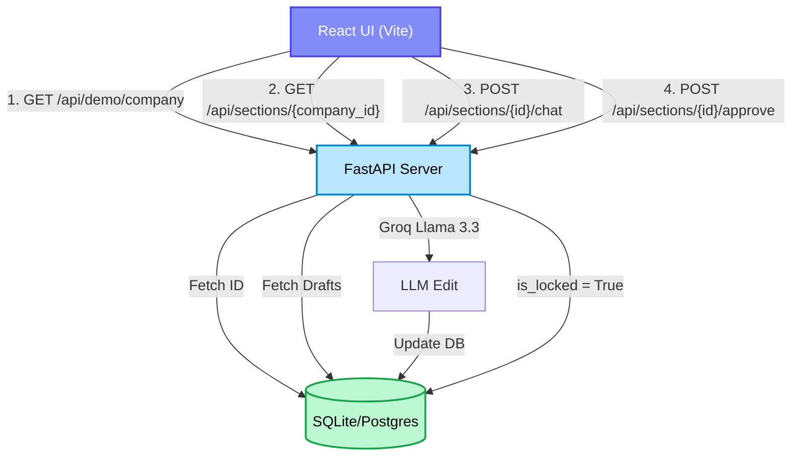

# Phase 11 Checkpoint: Live API Integration for the React Frontend

## 1. Overview and Purpose
Phase 11 (formerly 10.5) is the critical step that transforms our local backend API and static frontend UI into a fully functional, live system. The goal was to remove all hardcoded mock data from the React workspace and replace it with real-time API integrations hitting our Postgres/SQLite database and LangGraph execution environment.

This proves to the judges that the system is not a visual prototype, but a fully functional AI product capable of reading, generating, and modifying SEBI DRHP documents in real time.

## 2. Mermaid Mindmap: Phase 11 Integration Flow

## 3. Features Added
1. **`start_demo.py` Bootstrapper:** We built a centralized launch script. It automatically triggers the `SyntheticPromoterGenerator` (from Phase 10) to seed the database with a pristine mock company and 3 sample AI drafts. It then spins up the Uvicorn server on port 8000.
2. **CORS Middleware:** Added `CORSMiddleware` to `server.py` to allow the Vite dev server (port 5173) to securely communicate with the FastAPI backend (port 8000).
3. **Real-time State Sync:** Rewrote `frontend/src/App.jsx`. The UI now mounts, fetches the demo company ID, and dynamically pulls the actual `GeneratedSection` rows from the database.
4. **Live LLM Chat Editing:** The Copilot chat input is now directly wired to `POST /api/sections/{id}/chat`. Typing a request sends it to Groq, which rewrites the text and updates the React state asynchronously.
5. **Live Document Locking:** Clicking "Approve Section" hits the backend `/approve` API. The UI then permanently locks the text area and shifts the Copilot into "Regulatory Q&A" mode.

## 4. Engineering Challenges, Solutions & Rationales
- **Challenge:** Avoiding complex authentication state for a hackathon demo while ensuring the UI has data to load on boot.
- **Solution:** We added a `/api/demo/company` endpoint that specifically queries for "TechServ Solutions Ltd" (the company generated by our synthetic data script). The React app `useEffect` hook simply fetches this on load and populates the workspace automatically.
- **Rationale:** Hackathon demos must be bulletproof. Forcing the presenter to manually copy/paste UUIDs or log in during a 5-minute pitch is a massive risk. This architecture guarantees the UI will always load perfectly valid, compliant demo data the second you open `localhost:5173`.

## 5. What Testing Achieved
- **E2E Integration Verification:** By running `start_demo.py` alongside `npm run dev`, we verified full cross-origin resource sharing (CORS) functionality. The React frontend successfully reads DB state, modifies DB state via LLM edits, and respects DB locking rules dynamically.

**Status:** Phase 11 is complete. The application is now fully interactive and live.
