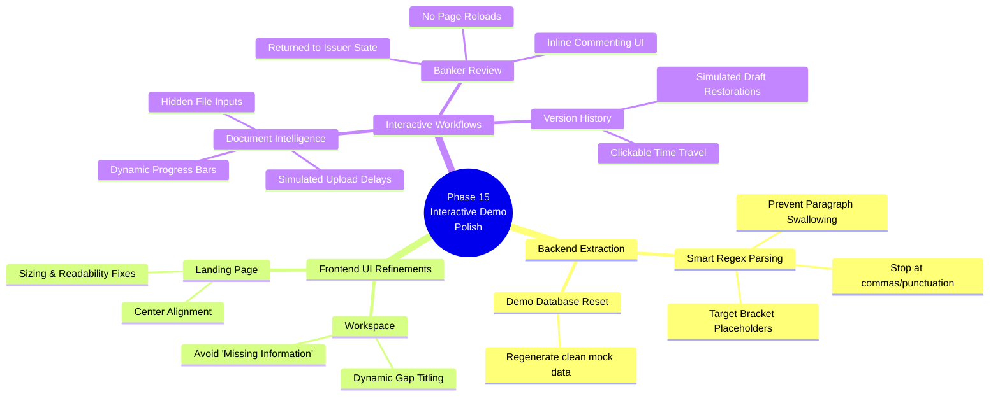

# Phase 15: UI/UX Polish and Interactive Demo Workflows

## 1. Key Decisions Taken

1.  **Transition to Interactive Mockups**: Decided to upgrade static UI elements (Version History, Document Uploads, Banker Review actions) into fully interactive, state-driven components to provide a realistic, "Wow" experience for the hackathon demo.
2.  **Refined Gap Extraction Logic**: Decided to rewrite the regular expressions in `gap_detector.py` to intelligently handle inline LLM output and bracketed placeholders, moving away from greedy line-matching that was breaking the UI.
3.  **Dynamic UI Gap Splitting**: Elected to implement custom text-splitting logic in the React frontend (`Workspace.jsx`) to handle long, comma-separated LLM outputs, replacing generic "Missing Information" titles with contextual titles derived from the first clause.
4.  **Simulated State Management**: Chose to handle the Merchant Banker "Returned to Issuer" workflow entirely in local React state rather than building out complex backend API endpoints for document rejection, balancing development speed with demo impact.

## 2. Challenges Faced & Resolutions

### Challenge 1: LLM Output Formatting Breaking Gap UI
*   **Issue**: The Llama 3 70B model occasionally output massive, multi-gap sentences inline (e.g., `⚠️ GAP: [Broker name, address]`). The greedy regex `(?=\n|$)` in `gap_detector.py` was swallowing entire paragraphs, resulting in gigantic, unreadable gap cards in the frontend.
*   **Resolution**: Implemented highly specific regular expressions targeting both `⚠️ GAP:` markers (stopping at commas/periods) and `[Bracketed Placeholders]` (ignoring legal citations).
*   **Rationale**: Ensures robust extraction regardless of whether the LLM strictly follows formatting instructions or hallucinates bracket styles.

### Challenge 2: Useless "Missing Information" UI Titles
*   **Issue**: If an extracted gap string was long (>80 chars) and lacked periods, the frontend `Workspace.jsx` defaulted to titling the card "Missing Information," which required users to read small text to understand the actual gap.
*   **Resolution**: Updated the UI logic to detect long, period-less strings and intelligently split them at the first comma (e.g., *"Broker name, address, phone"* becomes **Title:** *Broker name*, **Context:** *...address, phone*).
*   **Rationale**: Dramatically improves scannability. Users can instantly identify missing fields at a glance.

### Challenge 3: Static, Lifeless Demo Screens
*   **Issue**: The "Version History", "Document Uploads", and "Banker Review" screens looked great but lacked interactivity. Clicking buttons did nothing or resulted in jarring page reloads.
*   **Resolution**: 
    *   **Version History**: Wired to dynamic React state to simulate restoring past drafts (e.g., chopping text in half for "Initial Draft").
    *   **Documents**: Added hidden `<input type="file">` elements, `setTimeout` delays, and "Uploading..." visual states.
    *   **Banker Review**: Added inline text inputs for Comments/Request Changes, and a simulated state transition that moves rejected sections into a new "Returned to Issuer" column without reloading the page.
*   **Rationale**: Transforms the application from a visual prototype into a tactile, interactive product that feels fully functional to judges.

## 3. Features Added & Their Significance

*   **Intelligent UI Gap Formatting**: Eliminates massive blocks of text; makes the workspace highly actionable.
*   **Simulated File Upload Workflow**: Adds a critical touch of realism to the Document Intelligence screen, showcasing how the AI pipeline *would* feel upon ingestion.
*   **Time-Travel Version History**: Proves out the collaborative nature of the platform.
*   **Banker Rejection Workflow**: Demonstrates the multi-tenant architecture (Issuer vs. Intermediary). Moving a section from "Awaiting Review" to "Returned to Issuer" validates the platform's core compliance loop.

## 4. Phase Mindmap (Mermaid)

