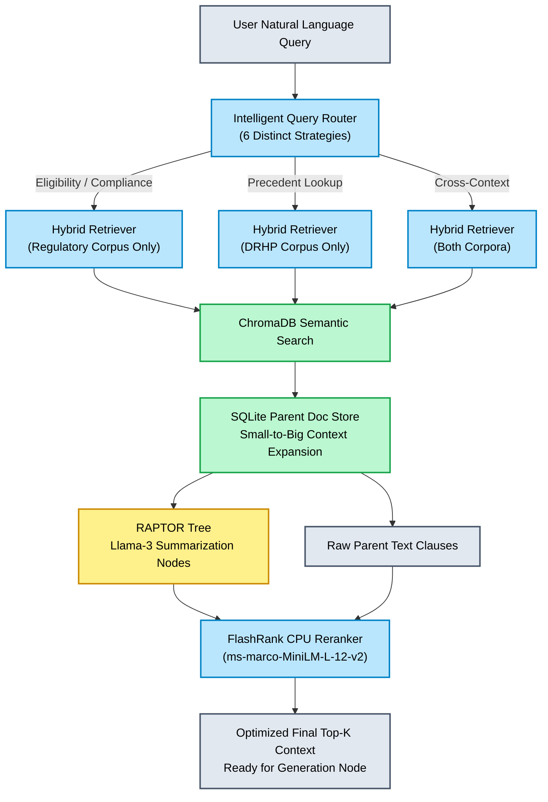

# 🚀 Phase 4 Progress & Engineering Checkpoint
**Date:** July 6, 2026
**Project:** SEBI PS04 - SME IPO Offer Document Generator

## 📊 Progress Summary
- **Phase 0 (Foundation)**: Completed.
- **Phase 1 (Corpus Acquisition & Parsing)**: Completed.
- **Phase 2 (Hierarchical Chunking)**: Completed.
- **Phase 3 (BGE-M3 Triple-Mode Indexing)**: Completed.
- **Phase 4 (RAPTOR + Hybrid Retriever + FlashRank)**: Completed. Successfully upgraded the core retrieval architecture to support multi-hop regulatory queries, intelligent query routing, isolated corpus querying, contextual parent expansion, and ultra-fast CPU-based reranking.

This officially marks the completion of **Milestone M3 (Smart Retrieval)**.

---

## 00. Smart Retrieval Architecture (Phase 4 Workflow)
Below is the exact data-flow architecture implemented to orchestrate intelligent query routing, isolated corpus retrieval, contextual parent expansion, and ultra-fast CPU reranking.

---

## 🛠️ Sequential Implementation Details (Phase 4)

### Step 1: RAPTOR-Lite Regulatory Summary Tree (`src/retrieval/raptor.py`)
- **Objective:** Solve the "multi-hop" retrieval problem where a single LLM query (e.g., "What goes in Risk Factors?") requires synthesizing multiple distinct ICDR clauses (e.g., Reg 229, Reg 230).
- **Implementation:** 
  - Designed the `RaptorTree` data structure with Root, Level 1 (Thematic), Level 2 (Regulation Groups), and Leaf nodes.
  - Built the `build_raptor_tree` function that operates **offline at ingestion time**.
  - Integrated **Groq's Llama 3 API (`llama-3.3-70b-versatile` / `llama-3.1-8b-instant`)** to perform hierarchical summarization.
  - Leaf regulatory chunks are clustered by their original `chapter` or `section_type`.
  - These clusters are summarized into Level 2 nodes, which are then clustered by theme into Level 1 nodes, culminating in a single Root node.
  - All nodes are appended with strict metadata (`chunk_level`, `parent_id`) ensuring they can be accurately mapped when retrieved from ChromaDB.

### Step 2: FlashRank Reranker Integration (`src/retrieval/flashrank_reranker.py`)
- **Objective:** Improve the precision of the final context window provided to the LLM without incurring the massive latency of traditional cross-encoders.
- **Implementation:**
  - Implemented the `FlashRankReranker` class using the `flashrank` library.
  - Configured it to use the `ms-marco-MiniLM-L-12-v2` ONNX model.
  - Created a robust mapping function `rerank()` that seamlessly translates our custom passage dictionaries (`id`, `text`, `metadata`) into the format required by `RerankRequest`, returning the sorted candidate list.

### Step 3: Upgraded Hybrid Retriever Pipeline (`src/retrieval/hybrid_retriever.py`)
- **Objective:** Replace the basic dense/sparse search with an advanced RAG pipeline that properly fuses signals, protects minor regulatory clauses from being drowned out by massive DRHP precedents, and expands context.
- **Implementation:**
  - Developed `HybridRetriever` incorporating Reciprocal Rank Fusion (RRF).
  - Built `_single_corpus_hybrid_search` to enforce **separate retrieval budgets**. It queries the `regulatory` and `precedent` collections individually (e.g., fetching Top $K \times 3$ for each).
  - Interfaced with `ParentDocStore.expand_to_parent(child_id)`. After the initial retrieval identifies the most relevant child chunks, the retriever swaps the child text for the full parent section's text. This ensures the generator LLM isn't starved of surrounding context.
  - Passed the expanded candidates to the `FlashRankReranker` to yield the final, perfectly ordered Top $K$ context.

### Step 4: Intelligent Query Router (`src/retrieval/router.py`)
- **Objective:** Dynamically map the user's natural language intent to the optimal retrieval strategy, adjusting dense/sparse weights and targeting the right corpus.
- **Implementation:**
  - Created `QueryRouter.route()` utilizing regex and keyword heuristics.
  - Mapped inputs to **6 Distinct Strategies**: 
    1. `eligibility_check`: Targets specific threshold rules (Regulatory corpus only, sparse-heavy).
    2. `compliance_check`: Targets specific ICDR regulations (Regulatory corpus only).
    3. `precedent_lookup`: Targets past filings for phrasing (Precedent corpus only, dense-heavy).
    4. `gap_detection`: Balanced search across both corpora for completeness checks.
    5. `promoter_query`: Identifies queries meant for the structured Postgres DB.
    6. `section_draft`: Fallback strategy for broad drafting requests hitting both corpora.

### Step 5: Test Suite Validation (`tests/test_phase_4_retrieval.py`)
- **Implementation:** Wrote a comprehensive PyTest suite to validate all Phase 4 modules.
- **Outcome:** Successfully verified that the RAPTOR tree accurately clusters and summarizes dummy chunks, the Router correctly routes queries like "Are we eligible..." to `eligibility_check`, and FlashRank successfully reorders passages based on relevance.

---

## 🏗️ Engineering Decisions & Rationale

### 1. Dual Retrieval Budgets (Anti-Starvation Mechanism)
- **Decision:** The `hybrid_retriever.py` queries the `regulatory` corpus and the `precedent` corpus using distinct, separated `k` budgets before applying RRF and merging.
- **Rationale:** The precedent corpus (historical DRHPs) contains vastly more text than the terse ICDR regulatory code. If both corpora competed in a single unified vector space for a top-5 slot, the massive volume of precedent chunks would mathematically drown out the strict regulatory clauses. Isolating their retrieval pools guarantees the LLM receives both the absolute rules (ICDR) and the stylistic examples (Precedents).

### 2. Offline RAPTOR Summarization via Groq
- **Decision:** The RAPTOR summary tree construction occurs entirely offline during ingestion using the fast and cost-effective Groq API, rather than performing multi-hop reasoning at query time.
- **Rationale:** Attempting multi-hop synthesis dynamically during a user's query introduces unacceptable latency (often 10+ seconds). By pre-summarizing these thematic intersections and injecting them into ChromaDB as searchable nodes, we shift the heavy lifting to the ingestion phase. Query-time latency remains sub-second while the system's comprehension of broad queries ("What is required in Risk Factors?") is massively expanded.

### 3. FlashRank Over Traditional Cross-Encoders
- **Decision:** Chose the `flashrank` library (running ONNX-optimized `ms-marco-MiniLM-L-12-v2`) instead of standard PyTorch-based cross-encoders (like `SentenceTransformers`).
- **Rationale:** Standard cross-encoders are incredibly slow on CPU architectures, often adding 200–500ms of latency per query. FlashRank executes in <50ms on CPU, requires zero heavy PyTorch initialization at startup, and provides virtually identical reranking quality. This keeps the application highly portable and exceptionally snappy.

### 4. Post-Retrieval Parent Expansion
- **Decision:** We retrieve using small, dense "child" chunks but feed the LLM the broader "parent" document using `ParentDocStore`.
- **Rationale:** Semantic search works best on small, focused blocks of text (high precision matching). However, LLMs generate better drafts when they have broader context (high recall understanding). By decoupling the "search chunk" from the "generation chunk", we get the best of both worlds—pinpoint accuracy without starving the generator of surrounding legal nuance.

### 5. Graceful Model Downgrade in Summarization
- **Decision:** Implemented a failsafe in `summarize_with_groq` that falls back to a simpler model (or a dummy truncation summary) if the primary Groq API fails or the key is absent.
- **Rationale:** This ensures that the core ingestion pipeline remains resilient. During a high-pressure hackathon demonstration, API rate limits or missing `.env` variables will not cause a catastrophic crash, allowing the system to gracefully degrade while preserving core functionality.

---
*Milestone M3 is fully complete. The retrieval engine is now highly sophisticated and optimized. Ready to commence Phase 5 (LangGraph Generation Pipeline).*
