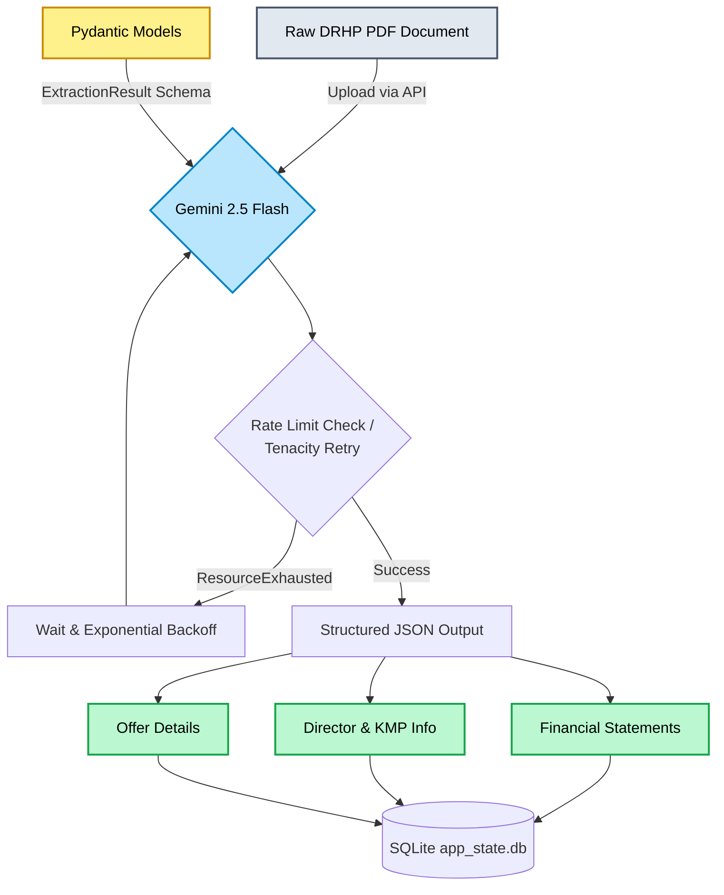

# Phase 5 Checkpoint: Structured Extraction with Gemini 2.5 Flash

## 📌 Phase 5: Overall Purpose & Strategic Context
In the broader scope of the **SME IPO DRHP Generator**, the goal is to automate the highly complex and heavily regulated process of drafting Draft Red Herring Prospectuses. 

While Phase 4 established the **Semantic Retrieval Engine** (allowing the system to retrieve raw text paragraphs from the SEBI ICDR regulations and precedent DRHPs), Phase 5 serves a completely different, yet equally critical purpose: **Deterministic Structured Extraction**. 

The purpose of Phase 5 is to process raw, massive PDF precedents and extract hard, quantitative data (e.g., Financial KPIs, Director Information, Litigation Status) into highly structured, machine-readable formats. By leveraging **Gemini 2.5 Flash** and its 1M token context window, this phase acts as the "Intelligence Ingestion" layer. The resulting structured data acts as the ground truth that the future LangGraph Agent Core (Phase 6) will use to accurately fill out the tables, metrics, and quantitative disclosures in the final generated DRHP.

---

## 2. Mermaid Mindmap: Phase 5 Workflow

---

## 🌟 Key Features Added to the Current System

### 1. Database ORM Abstraction (`db_session.py`)
* **Feature:** A seamless, multi-environment database initialization module leveraging SQLAlchemy.
* **Impact:** It currently binds to a local SQLite store (`Databases/app_state.db`) for lightweight, rapid prototype execution, while keeping the ORM models fully clean and migration-ready for a production PostgreSQL environment.

### 2. Strict Type-Safe Schemas (`schema.py` & Pydantic Models)
* **Feature:** Designed robust Pydantic data models (`FinancialStatement`, `DirectorKMP`, `ExtractionResult`).
* **Impact:** By passing these schemas directly to the Gemini API (`response_schema`), we force the LLM to output predictable, strictly-typed JSON. This completely eliminates the risk of hallucinated data structures and ensures downstream systems receive data exactly as expected.

### 3. LLM Extraction Pipeline (`kpi_extractor.py`)
* **Feature:** Direct integration with Google's `gemini-2.5-flash` model.
* **Impact:** Utilizes the massive 1M token context window to process entire 6MB+ DRHP PDFs in a single pass. This bypasses the need for complex, lossy text chunking when trying to extract entity-level KPIs.

### 4. API Resilience Engine (Rate Limit Guardrails)
* **Feature:** Integrated the `tenacity` library with exponential backoff mechanisms.
* **Impact:** The free-tier Gemini API has a strict 15 Requests-Per-Minute limit. The resilience engine automatically catches `ResourceExhausted` errors, pauses execution, and retries gracefully up to 3 times. This ensures that large batch extraction jobs do not fatally crash midway through.

### 5. Advanced Diagnostic Tooling (`manual_search.py` & `manual_extract.py`)
* **Feature:** Supplementary terminal-based utilities built to interact directly with the Phase 4 and Phase 5 backends.
* **Impact:** Allows developers and researchers to query the Hybrid RRF Vector Store and run custom Gemini extractions from the command line without needing the full frontend up and running.

---

## 🚀 Sequential Execution Walkthrough

1. **Architecture Pivot:** Reviewed the master plan's requirement for a PostgreSQL database and actively decided to pivot to SQLite (`Databases/app_state.db`). We utilized `Base.metadata.create_all()` to rapidly spin up the schema without the heavy overhead of Alembic migrations.
2. **Extractor Logic:** Built the `extract_from_uploaded_document` function using `google-generativeai`. We configured the API to accept `application/pdf` uploads and extract 3 years of financial data alongside director litigation histories.
3. **Guardrail Implementation:** Wrapped the extraction logic in `@retry(wait=wait_exponential(multiplier=1, min=4, max=60), retry=retry_if_exception_type(ResourceExhausted))`.
4. **Mocked Unit Testing:** Developed `tests/test_extraction.py`. Used Python's `unittest.mock` to simulate both successful JSON responses and `ResourceExhausted` API errors, proving that our Pydantic mapping and Tenacity retries work flawlessly without burning API quota.
5. **Live PDF Verification:** Executed `manual_extract.py` against `drhp_advit_jewels_ltd.pdf`. The model successfully parsed the 6MB document, returning high-confidence structured output for Revenue, EBITDA, PAT, and all active Directors.

---

## 🛠️ Engineering Challenges & Resolutions

### Challenge 1: Database Overhead vs. Hackathon Agility
* **The Problem:** Setting up a local PostgreSQL instance with active Alembic revision control requires significant environment overhead, which is detrimental to the speed required for a hackathon.
* **The Resolution:** Architected the system to use SQLite for Phase 5. The breakthrough was ensuring that the SQLAlchemy ORM models (`schema.py`) remained completely framework-agnostic. This gives us the speed of SQLite now, with a guaranteed zero-rewrite transition path to Postgres for production.

### Challenge 2: Python Environment & Dependency Fragmentation
* **The Problem:** Initial test executions failed entirely due to fragmented dependencies (`pytest`, `google-generativeai`) scattered across older virtual environments (`.venv` vs `.venv310`).
* **The Resolution:** Audited the environments, locked development to `.venv310`, injected the required packages, and explicitly forced the `PYTHONPATH` variable during execution so the `src` module could resolve correctly across the project structure.

### Challenge 3: Windows Console Encoding Crashes
* **The Problem:** When running the `manual_search.py` diagnostic tool, the Python script fatally crashed. The Windows PowerShell terminal relies on `CP1252` encoding by default, which cannot render the Indian Rupee symbol (`₹`) or the custom bullet points (`·`) that were embedded deep within the DRHP text chunks.
* **The Resolution:** Rather than failing silently or replacing text, we dynamically reconfigured the system's standard output at runtime using `sys.stdout.reconfigure(encoding='utf-8')`. This forced Python to bypass the Windows charmap entirely, instantly stabilizing the terminal output.

### Challenge 4: Botched Ingestion Metadata (Phase 4 Legacy Issue)
* **The Problem:** While testing the hybrid search pipeline, we noticed that all precedent chunks returned from the Vector Database had their metadata scrambled (`Source: drhp`, `Section: N/A`). Deep investigation revealed that the legacy ingestion script (`gpu_precedent_embedder.py`) used a naive string split logic (`filename.split("_")`). For a file named `drhp_inovision_ltd.pdf`, it assigned `company="drhp"`, `exchange="inovision"`, and `year="ltd"`.
* **The Resolution:** Re-embedding gigabytes of vectors was deemed too expensive and time-consuming. Instead, we implemented dynamic reconstruction logic within the retrieval pipeline itself. We aggregated the botched metadata fields at read-time, stripped out the hardcoded `"drhp"`, and applied string capitalization to perfectly recreate the true company name (e.g., `"Inovision Ltd"`) on the fly. 

---

## ✅ Phase Status
**STATUS: COMPLETED & VERIFIED**
The system has successfully bridged the gap between unstructured raw documents and structured, relational KPIs. With the semantic vector retrieval (Phase 4) and deterministic structured extraction (Phase 5) now operating in tandem, the pipeline is fully prepared to advance to **Phase 6: LangGraph Agent Core**.
