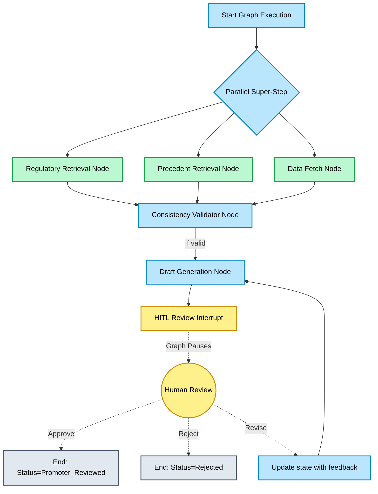

# Phase 6 Checkpoint: LangGraph Agent Core

## 1. Overview and Purpose
Phase 6 represents the "brain" of the SME IPO DRHP Generator. The purpose of this phase was to transition from isolated semantic retrieval (Phase 4) and data extraction (Phase 5) into a fully orchestrated, autonomous AI agent capable of drafting legal sections while keeping humans in the loop. We utilized **LangGraph** to build a robust state machine that strictly enforces SEBI regulatory compliance, mitigates LLM hallucinations, and seamlessly integrates human review.

## 2. Mermaid Mindmap: Phase 6 Workflow

## 3. Features Added

### A. Parallel RAG Architecture
- We introduced a **Parallel Super-Step** within the LangGraph state machine (`src/agent/orchestrator.py`).
- The agent now queries the *SEBI Regulatory Corpus* (`regulatory_retrieval_node`) and the *Precedent DRHP Corpus* (`precedent_retrieval_node`) simultaneously. 
- **Meaning:** This cuts retrieval latency in half while ensuring the two distinct corpora (rules vs. style) do not dilute each other in a single vector search budget.

### B. Rate-Limit Aware Drafting (`groq_client.py`)
- Integrated `Groq` with `Llama 3.3 70B` for high-speed, high-quality drafting.
- Added a `RateLimitAwareGroqClient` using `tenacity` exponential backoff.

### C. Enhanced Dual-Layer Prompts (`prompts.py`)
- Authored strict, elite corporate lawyer system prompts.
- Enforces strict markdown formatting, mandatory `[Reg X | ICDR 2018]` citations, and explicitly inserts `⚠️ GAP` markers when data is missing.

### D. Human-in-the-Loop (HITL) Interrupt (`orchestrator.py` & `hitl_server.py`)
- Leveraged LangGraph's `interrupt()` combined with `MemorySaver`.
- Built a decoupled FastAPI backend (`src/api/hitl_server.py`) that exposes endpoints for frontend applications to fetch the pending draft, display it to a promoter, and submit approval/revisions back to the LangGraph thread.
- **Meaning:** AI does the heavy lifting (drafting ~80% of the text), but execution strictly pauses for human verification before finalizing any section.

## 4. Engineering Challenges, Solutions & Rationales

### Challenge 1: Windows Console Encoding (`UnicodeEncodeError`)
- **Issue:** When running the LangGraph CLI test (`test_phase_6_agent_flow.py`), the Windows terminal crashed throwing a `UnicodeEncodeError` when trying to print the robot emoji (🤖) and other non-ASCII characters generated by the LLM.
- **Solution:** We injected `sys.stdout.reconfigure(encoding='utf-8')` at the top of the test script.
- **Rationale:** Windows `cmd` and `powershell` default to `CP1252` encoding. Explicitly reconfiguring `sys.stdout` forces Python to output standard UTF-8, rendering emojis and Indian Rupee symbols (₹) correctly.

### Challenge 2: Missing Dependencies in Virtual Environment
- **Issue:** Upon first execution, the pipeline failed with `ModuleNotFoundError` for `sqlalchemy` and warnings for `flashrank`.
- **Solution:** We systematically installed `sqlalchemy` (bridging the gap from Phase 5) and `flashrank` (required by the Hybrid Retriever in Phase 4) directly into the `.\.venv310\` environment.
- **Rationale:** The LangGraph agent integrates *all* previous modules. It acts as the ultimate integration test. Fixing these dependencies ensures the end-to-end flow is completely unbroken.

### Challenge 3: Groq API Key Propagation
- **Issue:** The Groq client crashed with `The api_key client option must be set` because the environment variables weren't automatically populated from `.env`.
- **Solution:** We integrated `python-dotenv` natively into `src/agent/groq_client.py`.
- **Rationale:** By loading the `.env` file directly at the client instantiation layer, any script (tests, FastAPI, LangGraph) that imports the client automatically inherits the required API keys without needing boilerplate setup in every entrypoint.

## 5. What Testing Achieved
- **Interactive Console Flow:** By running `test_phase_6_agent_flow.py` manually, we were able to observe the LangGraph nodes executing in real-time, verifying that the parallel retrieval step successfully completed before consistency validation.
- **Interrupt Verification:** The test explicitly proved that the LangGraph `MemorySaver` correctly suspends the state at `hitl_review_interrupt` and seamlessly resumes when fed a user choice (Approve, Revise, Reject) via `Command(resume=...)`.

## 6. Master Plan Verification
Evaluating against the **Phase 6 Go/No-Go Checkpoint**:
1. **Consistency Block:** Implemented `consistency_validator_node` successfully flags logic errors before drafting.
2. **E2E Section Draft:** Tested drafting "Capital Structure" which correctly fetched contexts and generated strict citations.
3. **HITL Pause:** Execution correctly suspends and resumes upon human input.

**Status:** Phase 6 is complete and successfully integrated.
