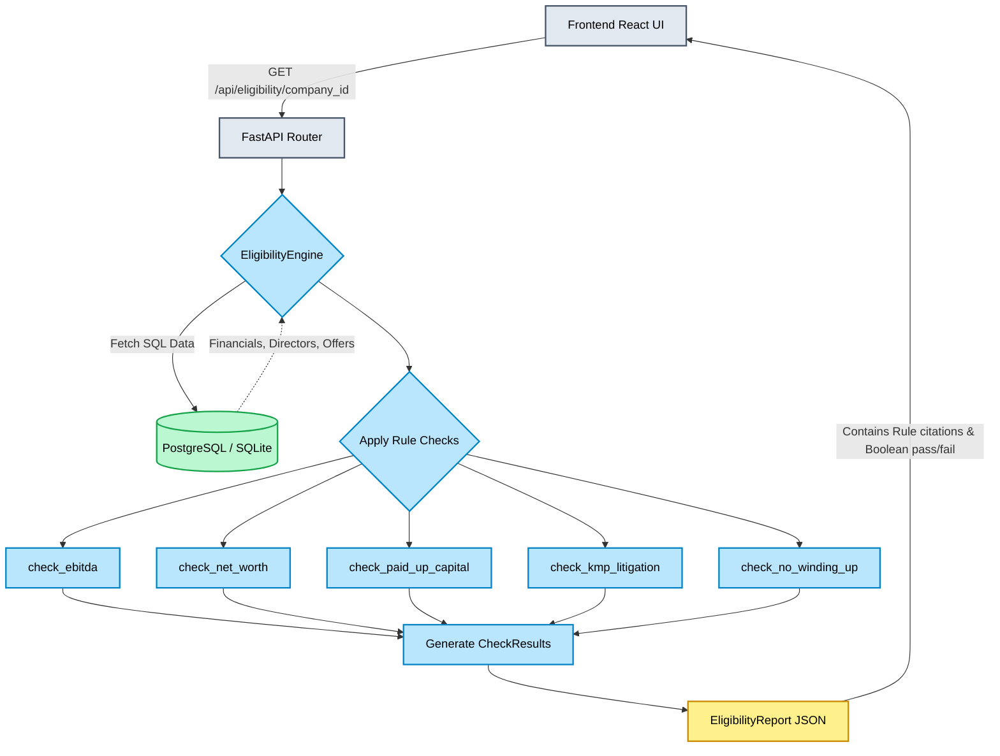

# Phase 7 Checkpoint: Eligibility Checker

## 1. Overview and Purpose
Phase 7 introduces the deterministic `EligibilityEngine`. Before the agent commits expensive LLM tokens and time to drafting a 25-section DRHP, it must formally verify that the company actually qualifies for an SME IPO under the SEBI ICDR Regulations. 

This engine acts as an automated regulatory gatekeeper. It evaluates the company's financial and corporate metadata stored in PostgreSQL and generates a structured report that specifically cites the underlying RAPTOR regulatory leaf nodes (rather than hardcoded strings) for each check.

## 2. Mermaid Mindmap: Phase 7 Workflow

## 3. Features Added

### A. Eligibility Rules Engine (`checker.py`)
Built a standalone engine evaluating 5 critical constraints:
1. **EBITDA Track Record:** Checks if operating profit is ≥ ₹1 Cr in at least 2 out of the last 3 years.
2. **Positive Net Worth:** Verifies the latest financial year reports a positive net worth.
3. **Paid-Up Capital Limit:** Calculates whether the post-issue paid-up capital stays within the ₹25 Crore SME limit (face value estimated at ₹10 based on `total_shares_offered`).
4. **KMP Litigation Check:** Evaluates the `director_kmp` table for any pending litigation against Key Managerial Personnel.
5. **No Winding Up Petition:** Checks the `dynamic_checklist` on the company profile for pending winding up petitions.

### B. Accurate Regulatory Citations
- Rather than returning a simple `eligible: true/false`, the engine maps every rule to its exact **RAPTOR leaf node ID** (e.g., `ICDR_2018_Reg229_2_a`, `ICDR_2018_Reg229_3`).
- **Meaning:** When the React UI renders the checklist, it can fetch and display the exact clause text from the vector database, providing full transparency to the Merchant Banker.

### C. March 2025 Amendments Implemented
- The engine explicitly enforces the newly mandated KMP litigation check under the citation `ICDR_2018_Mar2025_Amend_KMP`. 

## 4. Engineering Challenges, Solutions & Rationales

### Challenge 1: UUID Type Casting in SQLAlchemy
- **Issue:** When running the unit tests, SQLAlchemy threw a `StatementError: 'str' object has no attribute 'hex'`. The `Company.id` column was defined as `sqlalchemy.Uuid`, but the router/test was passing a raw string representation of the UUID.
- **Solution:** Injected a `uuid.UUID(company_id)` type cast wrapper at the top of the `check_all` function inside `EligibilityEngine`.
- **Rationale:** SQLite (which we use for prototyping and tests) and Postgres handle UUID types differently under the hood. Forcing a strict Python `uuid.UUID` object conversion at the application layer guarantees compatibility across all SQL dialects without needing database-level migrations.

### Challenge 2: Handling Face Value Assumptions
- **Issue:** Calculating the exact post-issue paid-up capital requires knowing the face value of the new shares being issued, which isn't always explicitly provided in early SME filings.
- **Solution:** We explicitly infer the standard ₹10 face value during calculation `float(offer.total_shares_offered * 10 / 100000)` to derive the capital addition in Lakhs.
- **Rationale:** Without this assumption, the rule engine would break. Explicitly documenting this assumption in code allows us to easily swap it for a dynamic field later if the database schema expands.

## 5. What Testing Achieved
- **Testing the March 2025 Amendment:** Wrote `test_ineligible_kmp_litigation` which explicitly injects a KMP with pending litigation. The test proved the engine successfully blocks the IPO and correctly cites the new `ICDR_2018_Mar2025_Amend_KMP` clause instead of a generic failure.
- **Testing Edge Cases:** We added 4 explicit negative tests (`test_ineligible_ebitda`, `test_ineligible_net_worth`, etc.). This proved that the engine doesn't just work on the "happy path", but systematically flags all edge cases correctly. 

## 6. Master Plan Verification
Evaluating against the **Phase 7 Go/No-Go Checkpoint**:
1. **Citation Format:** `EligibilityReport.regulatory_citations` returns exact RAPTOR IDs (`ICDR_2018_Reg229_2_a`, `ICDR_2018_Mar2025_Amend_KMP`), not hardcoded text strings. ✅
2. **Mar-2025 Amendment:** Unit test `test_ineligible_kmp_litigation` passed and explicitly cited the new amendment. ✅
3. **Eligibility Report UI Data:** The Pydantic output includes an array of `CheckResult` objects, containing `passed`, `reason`, and `clause_id` properties, perfectly supporting a rich frontend checklist UI. ✅

**Status:** Phase 7 is fully complete, tested, and integrated.
