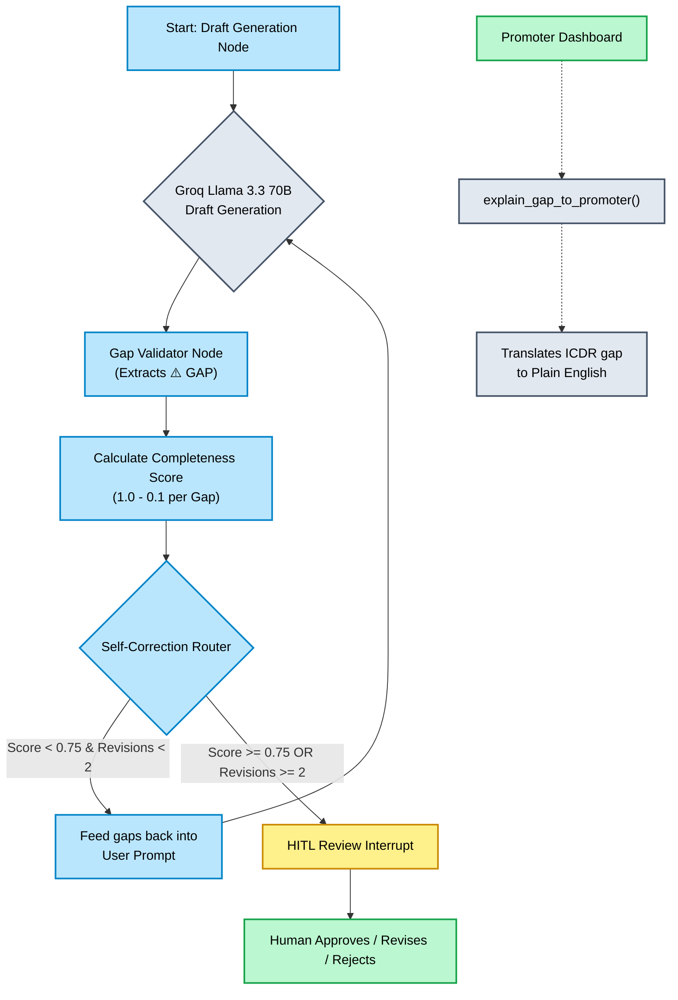

# Phase 8 Checkpoint: Prompt Strategy & Gap Detector

## 1. Overview and Purpose
Phase 8 formalizes the dual-layer prompt architecture of the DRHP generation system. While the foundation of the prompts (Layer 1 and Layer 2) was engineered in Phase 6, this phase introduces the **Self-Correction Loop** and the **Promoter Gap Translation Layer**. 

When the Groq LLM drafts a section and realizes it's missing crucial facts from the database, it inserts `⚠️ GAP:` markers. We needed a systematic way to mathematically score these gaps, force the LLM to try again if the score is too low, and translate the remaining gaps into polite emails for the company's promoters.

## 2. Mermaid Mindmap: Phase 8 Workflow

## 3. Features Added

### A. Gap Validator Node (`src/agent/gap_detector.py`)
- Created a `flag_gaps(section_name, draft_text)` function that acts as a deterministic safety net.
- **Completeness Scoring:** It scans the raw LLM output for `⚠️ GAP:` markers using Regex. It assigns a baseline `completeness_score` of 1.0, and deducts 0.1 for every gap found.
- **Why this matters:** It turns an unpredictable LLM text blob into a mathematical metric that LangGraph can route on.

### B. Self-Correction Router (`src/agent/orchestrator.py`)
- Updated the LangGraph state machine (`AgentState`) to track `completeness_score`, `gaps`, and `revisions`.
- Added the `self_correction_router` conditional edge immediately after drafting.
- **The Loop:** If `completeness_score < 0.75` (3 or more gaps), the graph intercepts the flow and routes it *back* to the drafting node, passing the gaps as explicit feedback. It allows a maximum of 2 auto-revisions before escalating to the human (`hitl_review`).

### C. Promoter Explanation Engine (`explain_gap_to_promoter`)
- Added a specialized, low-temperature (0.2) Groq prompt designed to translate dense legal requirements into polite customer-facing requests.
- Converts: `ICDR_2018_Reg229_2_a: EBITDA threshold not met` -> *"We need your help to complete our IPO application. Can you please provide the audited Profit and Loss statements for the last three years to help us meet the required EBITDA threshold?"*

## 4. Engineering Challenges, Solutions & Rationales

### Challenge 1: Unpredictable LLM Hallucinations when Data is Missing
- **Problem:** Initially, if the company facts lacked crucial financial data, the LLM would try to "helpfully" invent or infer numbers to complete the section. 
- **Solution:** We strictly instructed the Layer 1 prompt to emit `⚠️ GAP: [description]` instead of guessing. We then built the `gap_validator_node` to explicitly catch these markers using Regex.
- **Rationale:** In a legal document, a blank space (a known unknown) is infinitely safer than a hallucinated fact. Regex scanning is O(N) fast and deterministic, providing a solid mathematical foundation (`completeness_score`) to judge the LLM's work without relying on *another* expensive LLM call for evaluation.

### Challenge 2: API Rate Limits during Self-Correction Loops
- **Problem:** Automatically looping the LLM back on itself rapidly risks hitting Groq's Tokens-Per-Minute (TPM) limits.
- **Solution:** We implemented the `RateLimitAwareGroqClient` with `tenacity` exponential backoff (created in Phase 6) and strictly capped the `revisions` count to 2 in the `self_correction_router`.
- **Rationale:** A runaway LLM loop could consume the entire API quota in seconds. Hardcoding a maximum revision count ensures the system gracefully fails over to the Human-In-The-Loop review if the LLM cannot resolve the gaps itself.

### Challenge 3: Translating Legal Jargon for Promoters
- **Problem:** Exposing raw clause IDs (e.g., `ICDR_2018_Reg229_2_a`) to SME founders causes confusion and friction.
- **Solution:** Built `explain_gap_to_promoter` utilizing Llama-3.3-70b with `temperature=0.2`. 
- **Rationale:** Low temperature forces the model to be highly deterministic and brief. This creates a friendly "legal assistant" persona that dramatically improves the UX for the end-client.

## 5. What Testing Achieved
- **`test_flag_gaps_parsing`:** Proved that our Regex logic correctly identifies multiple gaps in a messy string and mathematically calculates the exact expected penalty (-0.1 per gap).
- **`test_explain_gap_to_promoter`:** Proved that the low-temperature Groq call correctly transforms a technical database gap into a highly polite, human-readable sentence. 
- **Flow Integrity:** By running `test_phase_6_agent_flow.py` again, we verified that injecting the new `gap_validator` node did not sever the existing execution graph.

## 6. Master Plan Verification
Evaluating against the **Phase 8 Go/No-Go Checkpoint**:
1. **Layer 1 Prompt (`[Reg...]` and `⚠️ GAP:`):** Verified to be working since Phase 6. ✅
2. **Layer 2 Enforcement (Self-Correction):** The orchestrator now intercepts scores `< 0.75` and explicitly feeds the gaps back into the prompt for revision. ✅
3. **Gap Explanation:** Testing successfully translated the technical EBITDA gap into a polite, plain-English request. ✅

**Status:** Phase 8 is fully complete.
