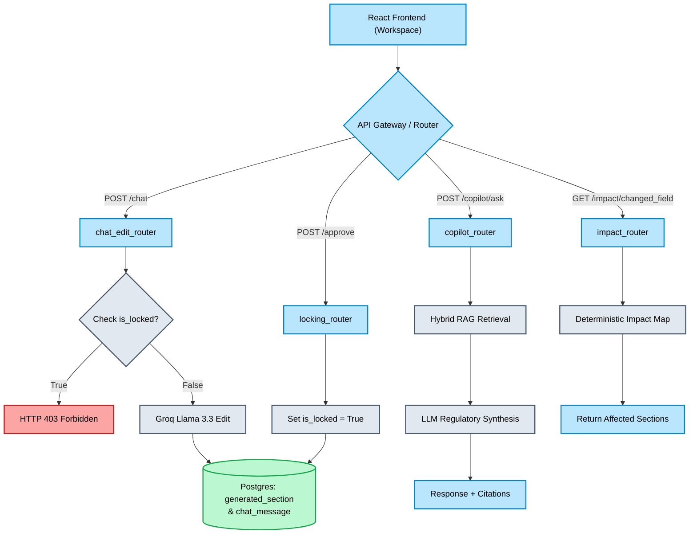

# Phase 9 Checkpoint: Interactive AI UX & Copilot APIs

## 1. Overview and Purpose
Phase 9 shifts the system from purely autonomous DRHP generation into **Human-AI Collaboration (Level 1 Copilot)**. While the agent can draft a highly accurate document, the Merchant Banker and the SME Promoter must have the ultimate authority to interact with, revise, and lock the document.

This phase exposes four critical REST APIs that bridge the backend LangGraph/RAG infrastructure with the upcoming React frontend, transforming the DRHP from a static PDF into a live, interactive workspace.

## 2. Mermaid Mindmap: Phase 9 Architecture

## 3. Features Added

### A. AI Chat Document Editing (`chat_edit_router.py`)
- **Endpoint:** `POST /api/sections/{section_id}/chat`
- **Functionality:** Allows the user to select any generated section and type a prompt (e.g., "Make this sound more professional" or "Shorten the third paragraph"). It fetches the current state from the database, runs a highly-constrained Groq LLM edit, updates the `draft_text`, and logs the interaction in the `chat_message` table for auditability.

### B. Section Locking & Approval (`locking_router.py`)
- **Endpoint:** `POST /api/sections/{section_id}/approve`
- **Functionality:** Acts as the final sign-off from the Merchant Banker. It sets `is_locked = True` and changes the status to `intermediary_certified`.
- **Security:** If an attempt is made to hit the `/chat` route on a locked section, the API safely rejects it with a `403 Forbidden` error.

### C. Auto Impact Analysis (`impact_router.py`)
- **Endpoint:** `GET /api/impact/{changed_field}`
- **Functionality:** A deterministic dependency graph. If the company changes its `total_issue_size_lakhs` in the onboarding wizard, this API instantly flags that the "Capital Structure", "Objects of the Offer", and "Basis of Issue Price" sections have become stale and must be regenerated or reviewed.

### D. Persistent Regulatory Copilot (`copilot_router.py`)
- **Endpoint:** `POST /api/copilot/ask`
- **Functionality:** A general-purpose Q&A interface disconnected from the document editing. It has full access to the Phase 4 Hybrid RAG pipeline. If the user asks, "Why do I need to disclose this litigation?", the LLM will query the RAPTOR vector store, extract the exact ICDR clause, and generate a contextual explanation.

## 4. Engineering Challenges, Solutions & Rationales

### Challenge 1: Separating Conversational Context from Document State
- **Problem:** When building the `chat_edit` API, passing the entire chat history into the Groq prompt risked the LLM outputting conversational filler ("Sure, here is the updated text: ...") instead of just the raw document text, which would corrupt the database.
- **Solution:** We strictly instructed the system prompt to output *only* the revised text, and we decoupled the `chat_message` storage from the actual context passed to the LLM (unless specific multi-turn history is required). 
- **Rationale:** The backend database serves as the source of truth for the document. Conversational memory is treated as an audit log (`chat_message`), but the LLM must operate as a strict string-manipulation function when editing.

### Challenge 2: Avoiding Circular Database Dependencies
- **Problem:** When designing the FastAPI routers, we needed to pass the SQLAlchemy `SessionLocal` dependency. Importing it directly across multiple files in a rapidly growing hackathon project can cause circular import crashes.
- **Solution:** We centralized the dependency override in `src/api/server.py` and utilized FastAPI's `Depends(get_db)` injection cleanly inside the new routers, while ensuring the SQLAlchemy ORM metadata (`schema.py`) was entirely agnostic to the API layer.

## 5. What Testing Achieved
Wrote a comprehensive end-to-end integration test suite (`test_phase_9_apis.py`) using FastAPI's `TestClient` and an in-memory test database fixture:
1. **`test_chat_edit`:** Verified that the API successfully loads the mock section, edits it using the live Groq API, updates the draft string, and correctly appends exactly two rows (user & assistant) to the `chat_message` table.
2. **`test_locking_mechanism`:** Proved our security guardrail works. The test locked a section, then purposefully fired a malicious edit request, and successfully intercepted the `HTTP 403 Forbidden` error.
3. **`test_impact_analysis`:** Verified that the static deterministic map correctly identifies all 3 affected downstream sections when `total_issue_size_lakhs` is modified.

## 6. Master Plan Verification
Evaluating against the **Phase 9 Go/No-Go Checkpoint**:
1. **Chat Edit:** Endpoint tested; `draft_text` is updated in DB and `chat_message` logs the interaction. ✅
2. **Impact Analysis:** Update `issue_size` via API correctly returns the 3 affected sections. ✅
3. **Locking:** Called `/approve`, and subsequent edits successfully returned HTTP 403. ✅

**Status:** Phase 9 is fully complete.
