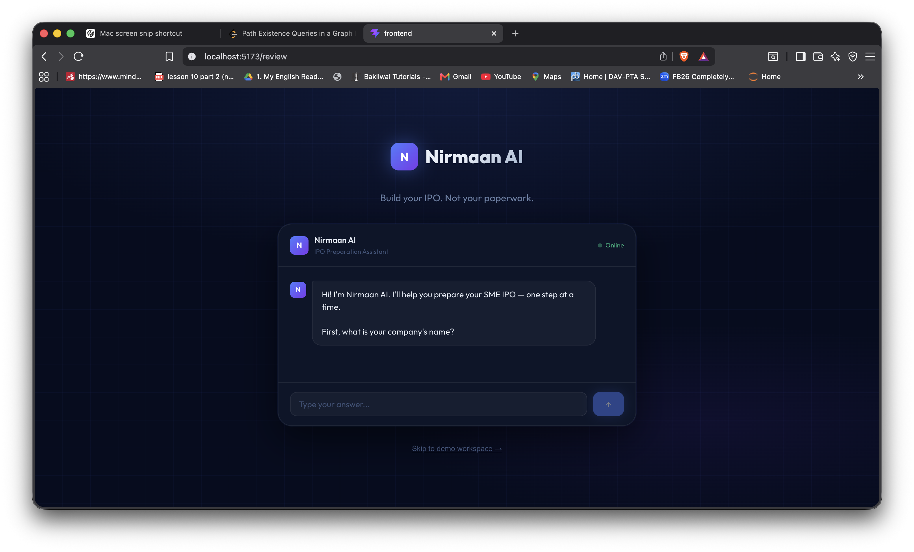
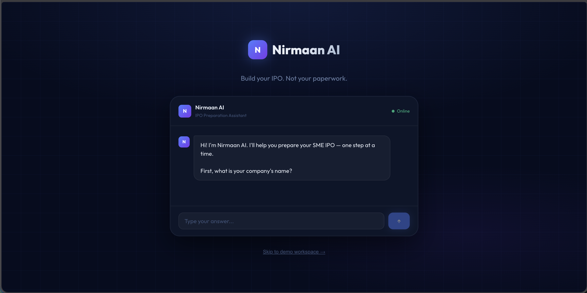
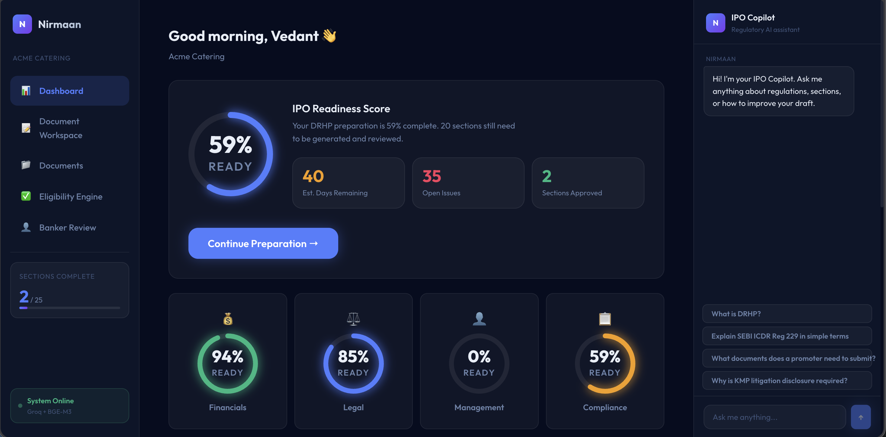
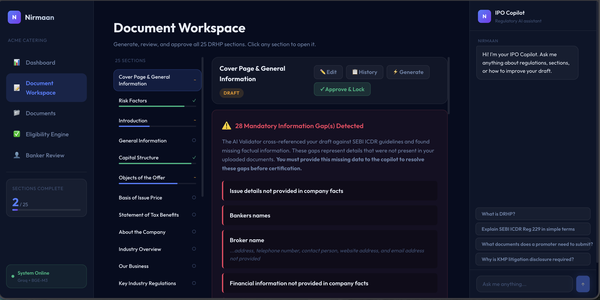
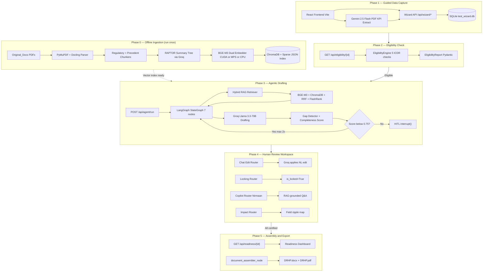

<div align="center">

# 🏛️ Nirmaan AI — SME IPO DRHP Generator

<!-- SEO Keywords: SME IPO, DRHP Generator, SEBI ICDR, LangGraph, FastAPI, React, ChromaDB, BGE-M3, FlashRank, Groq, Gemini, RAPTOR, Hybrid RAG, Human-in-the-Loop, Eligibility Engine, Compliance AI, Agentic RAG, SME Exchange, Gap Detection, Regulatory AI, Python, Vite -->

[](https://python.org)
[](https://fastapi.tiangolo.com)
[](https://react.dev)
[](https://vitejs.dev)
<br>
[](https://langchain-ai.github.io/langgraph/)
[](https://groq.com)
[](https://deepmind.google/technologies/gemini/)
<br>
[](https://trychroma.com/)
[](https://huggingface.co/BAAI/bge-m3)
[](https://sqlite.org/)
[](LICENSE)

> **An agentic AI platform built for SEBI Hackathon PS04 — enabling SME promoters to generate a substantially complete, SEBI ICDR-compliant Draft Red Herring Prospectus (DRHP) — reducing preparation time from months to hours, with zero specialist legal knowledge required.**

</div>

---

## 🖼️ Platform Preview

| Landing — Nirmaan Interview | IPO Readiness Dashboard |
|:---:|:---:|
|  |  |

| Document Workspace — 25-Section Editor | Gap Detection & Evidence Mapping |
|:---:|:---:|
|  |  |

---

## 🌟 What Makes This a Production-Grade Platform

Nirmaan AI is not a "GenAI wrapper." It is a precision-engineered, multi-layer regulatory AI system that solves the fundamental challenges that break standard LLM pipelines in the legal and compliance domain:

- ⚖️ **Dual-Corpus Hybrid RAG with RAPTOR**: Regulatory clauses (SEBI ICDR 2018) and real precedent DRHP filings are indexed in separate ChromaDB collections. A RAPTOR-lite summary tree (Leaf → Category → Theme → Root) enables hierarchical understanding — the system finds both exact regulatory clauses AND high-level thematic context in one retrieval pass.

- 🧠 **BGE-M3 Dual-Encoder Embeddings**: The `BAAI/bge-m3` model generates both **dense** (1024-dim semantic) and **sparse** (lexical weight) vectors simultaneously. Hardware acceleration is automatic — **CUDA** (Windows/Linux with NVIDIA GPU), **MPS/Metal** (macOS Apple Silicon), or **CPU fallback** (all platforms) — no code changes required.

- 🔗 **Reciprocal Rank Fusion + FlashRank Reranking**: Dense and sparse ranked lists are fused via RRF (k=60) with query-type-adaptive weights (compliance: sparse-heavy 0.65/0.35, precedent: dense-heavy 0.35/0.65). FlashRank's ONNX-based `ms-marco-MiniLM-L-12-v2` cross-encoder is hardware-accelerated on all platforms — **Apple Neural Engine** (CoreML EP on macOS), **TensorRT/CUDA** (Windows/Linux with NVIDIA GPU via ONNX Runtime CUDA EP), or **CPU ONNX** fallback.

- 🏗️ **LangGraph 7-Node Agentic Orchestrator with Self-Correction**: A stateful `StateGraph` with `MemorySaver` checkpointing runs parallel retrieval (regulatory + precedent + company data), drafts with Groq Llama 3.3-70B, validates gaps, and self-corrects up to 2× before escalating to Human-in-the-Loop review — all within a single agent invocation.

- 🛡️ **Anti-Hallucination Gap Detection**: The system never invents facts. All financial figures, names, and dates are sourced strictly from the structured SQLite database. Missing values are flagged inline as `⚠️ GAP: [field description]` — converting the draft into an auditable gap list for the promoter to resolve, not a document full of confident falsehoods.

- 🔒 **HITL Approval & Section Locking**: Merchant Bankers can certify sections via `POST /api/sections/{id}/approve`, which atomically sets `is_locked=True` and `status=intermediary_certified` — preventing further AI edits and preserving regulatory integrity.

- 📄 **Live SEBI Eligibility Engine**: Before any drafting begins, the system cross-checks 5 SEBI ICDR 2018 hard criteria (EBITDA track record, positive net worth, post-issue capital limit, KMP litigation, winding-up petition) against live company data and returns a Pydantic-validated `EligibilityReport` with per-clause citations.

- 🤖 **Nirmaan Copilot — Regulatory Q&A**: A RAG-grounded conversational assistant answers plain-English regulatory questions in real-time, citing exact `[Reg X | ICDR 2018]` clauses — eliminating the promoter's dependence on expensive legal consultants for basic compliance queries.

---

## 📑 Table of Contents

- [🌟 What Makes This a Production-Grade Platform](#-what-makes-this-a-production-grade-platform)
- [🛑 The Problem Being Solved](#-the-problem-being-solved)
- [📥 Quick Start](#-quick-start)
- [✨ Features](#-features)
- [🏗️ Architecture](#️-architecture)
- [📚 Documentation](#-documentation)
- [🧰 Tech Stack](#️-tech-stack)
- [📂 Project Structure](#-project-structure)
- [📈 Development Phases](#-development-phases)
- [🤝 Contributing](#-contributing)
- [⚠️ Disclaimer](#️-disclaimer)

---

## 🛑 The Problem Being Solved

> **SEBI Problem Statement PS04: Simplifying IPO Offer Document Preparation for SMEs**

Small and Medium Enterprises (SMEs) are a critical engine of economic growth, yet their participation in public capital markets remains severely limited. The primary barrier is the complexity and cost of preparing a DRHP — the mandatory offer document for any SME IPO on BSE SME or NSE Emerge.

**The Current Pain:**
- 🔴 **Months of preparation** — spans 4–8 months with continuous involvement of merchant bankers, legal counsel, and compliance professionals.
- 🔴 **Disproportionate cost** — professional fees often exceed 5–10% of the capital being raised for smaller SMEs.
- 🔴 **Knowledge barrier** — SME promoters with no capital markets experience cannot independently navigate the SEBI ICDR 2018 disclosure framework.
- 🔴 **Intermediary dependency** — heavy reliance on specialist intermediaries from the very first day, even for basic data gathering.

**What Nirmaan AI Delivers:**
- ✅ A guided, conversational interview (via "Nirmaan AI") captures all company data in plain English.
- ✅ An automated SEBI eligibility check runs before any resource is wasted on preparation.
- ✅ A LangGraph agent drafts all 25 DRHP sections using SEBI regulations + real precedent DRHPs as context.
- ✅ Every gap in information is surfaced explicitly — no hallucinated facts.
- ✅ A merchant banker approval portal preserves the regulatory role of certified intermediaries.
- ✅ Final DRHP export as `.docx` and `.pdf` ready for submission.

👉 **[Read the Full Problem Analysis →](docs/problem_statement.md)**

---

## 📥 Quick Start

**Prerequisites:** Python 3.10+, Node.js 20+, a free [Groq API Key](https://console.groq.com/), a free [Google AI Studio Key](https://aistudio.google.com/) (for PDF extraction)

### 1. Clone & Configure

```bash
git clone <your-repo-url> && cd SME-IPO-DRHP-Generator

# Create environment file and add your keys
echo "GROQ_API_KEY=gsk_your_key_here" > .env
echo "GEMINI_API_KEY=your_gemini_key_here" >> .env
```

### 2. Install Python Dependencies

```bash
# Recommended: use a virtual environment
python3 -m venv .venv && source .venv/bin/activate
pip install -r requirements.txt
```

> **Hardware Acceleration Notes:**
>
> | Platform | GPU | PyTorch Install | Acceleration |
> |---|---|---|---|
> | macOS (Apple Silicon) | M1/M2/M3/M4/M5 | Standard `pip install torch` | MPS (Metal Performance Shaders) — auto |
> | Windows / Linux | NVIDIA (CUDA 11.8+) | `pip install torch --index-url https://download.pytorch.org/whl/cu118` | CUDA — auto |
> | Windows / Linux | NVIDIA (CUDA 12.1+) | `pip install torch --index-url https://download.pytorch.org/whl/cu121` | CUDA — auto |
> | Any platform | None / CPU only | Standard `pip install torch` | CPU fallback — functional, slower |
>
> **Verify your acceleration after install:**
> ```bash
> python3 -c "
> import torch
> print('CUDA available :', torch.cuda.is_available())        # Windows/Linux NVIDIA
> print('MPS  available :', torch.backends.mps.is_available()) # macOS Apple Silicon
> "
> ```

### 3. Run Data Ingestion (One-Time Setup)

Place your PDF files in the correct directories:
```
Original_Docs/
├── Regulatory/          # SEBI ICDR 2018 regulations PDF(s)
└── Precedents/          # Real DRHP precedent PDFs (filename: Company_Exchange_Year.pdf)
```

Then run the ingestion pipeline:
```bash
python -m src.ingestion.runners.main_ingestion_runner
```

> This step: (1) parses PDFs via PyMuPDF + Docling, (2) chunks text, (3) builds a RAPTOR summary tree via Groq, (4) embeds with BGE-M3, (5) indexes in ChromaDB. Time: ~5–30 min depending on PDF count.

### 4. Seed the Demo Database

```bash
python scripts/start_demo.py
```

### 5. Start the Backend API

```bash
uvicorn src.api.server:app --host 0.0.0.0 --port 8000 --reload
```
🌐 API docs at: [http://localhost:8000/docs](http://localhost:8000/docs)

### 6. Start the Frontend

```bash
cd frontend
npm install
npm run dev
```

🌐 Open [http://localhost:5173](http://localhost:5173)

---

## ✨ Features

### 🎙️ Guided Onboarding Interview (Nirmaan AI)

- A conversational AI interview collects company name, industry, years in operation, revenue, and litigation status.
- Answers automatically populate the company database via `POST /api/demo/init`.
- A live eligibility check runs at the end of the interview — failing companies are flagged immediately.

### ⚖️ SEBI ICDR Eligibility Engine

Five hard regulatory checks against SEBI ICDR 2018:

| Check | Regulation | Criteria |
|---|---|---|
| EBITDA Track Record | Reg 229(2)(a) | ≥ ₹1 Cr operating profit in 2 of last 3 years |
| Positive Net Worth | Reg 229(1)(b) | Net worth > 0 in latest fiscal year |
| Post-Issue Capital | Reg 229(3) | Post-issue paid-up capital ≤ ₹25 Cr |
| KMP Litigation | Mar-2025 Amendment | No pending litigation against any KMP |
| No Winding Up | Reg 229(1)(c) | No winding up petition pending |

### 🤖 LangGraph Agentic Drafting Pipeline

A 7-node `StateGraph` handles the full drafting lifecycle per section:

1. **`regulatory_retrieval`** — Queries the SEBI ICDR regulatory corpus for the specific section's requirements.
2. **`precedent_retrieval`** — Retrieves real DRHP examples of the same section from precedent filings.
3. **`data_fetch`** — Pulls structured company data (financials, directors, offer details) from SQLite.
4. **`consistency_validator`** — Runs deterministic cross-field checks (e.g., negative net worth flags).
5. **`draft_generation`** — Groq Llama 3.3-70B generates a SEBI-compliant section draft with `⚠️ GAP:` markers for missing data.
6. **`gap_validator`** — Scans the draft for gaps, calculates a completeness score (0.0–1.0).
7. **`hitl_review`** — Pauses via LangGraph `interrupt()` for human review; resumes with `Command(resume=...)`.

Self-correction loop: If `completeness_score < 0.75` and `revisions < 2`, the agent automatically routes back to draft generation with the gap list as additional context.

### 📝 25-Section Document Workspace

Complete coverage of all mandatory DRHP sections as per SEBI's SME IPO framework:

| Group | Sections |
|---|---|
| **Cover & General** | Cover Page & General Information, Introduction, General Information |
| **Financial** | Capital Structure, Basis of Issue Price, Financial Statements (3 Years), MD&A |
| **Business** | About the Company, Industry Overview, Our Business, Key Industry Regulations |
| **Corporate** | History & Corporate Structure, Management & BOD, KMPs, Promoters & Promoter Group |
| **Legal** | Risk Factors, Related Party Transactions, Corporate Governance, Other Regulatory Disclosures |
| **Offer** | Objects of the Offer, Statement of Tax Benefits, Terms of the Issue, Dividend Policy |
| **Closing** | Material Contracts & Documents, Declaration & Undertakings |

### 🔍 Hybrid RAG Retrieval Engine

- **Dense Search**: ChromaDB L2 similarity via 1024-dim BGE-M3 embeddings.
- **Sparse Search**: In-memory inner product over fallback sparse JSON (BGE-M3 lexical weights).
- **RRF Fusion**: Reciprocal Rank Fusion merges both ranked lists with query-type-adaptive weights.
- **Parent Doc Expansion**: Child chunks are expanded to their full parent passage before LLM inference.
- **FlashRank Reranking**: `ms-marco-MiniLM-L-12-v2` cross-encoder (ONNX/CoreML-accelerated) scores `(query, passage)` pairs at interaction level.

### ✏️ Chat-Based Section Editing

- Locked sections → **Nirmaan Copilot**: answers regulatory questions, cited with `[Reg X | ICDR 2018]`.
- Unlocked sections → **AI Edit Mode**: Groq applies natural language revision requests directly to the draft.
- Full chat history is persisted to the `chat_message` table.

### 🔒 Section Locking & Merchant Banker Approval

- `POST /api/sections/{id}/approve` locks a section (`is_locked=True`, `status=intermediary_certified`).
- Locked sections become read-only in the workspace.
- A final `document_assembler` stitches all certified sections in SEBI TOC order into `.docx` + `.pdf` exports.

### 📊 IPO Readiness Dashboard

- **Animated Score Ring**: SVG-based readiness percentage with spring-animation fill.
- **Sub-score breakdown**: Financial, Legal, Management, Compliance scores.
- **Section Pipeline**: Approved / In Draft / Not Started counts.
- **Next Actions**: Urgent items with gap-driven recommendations.
- **Estimated days remaining** auto-calculated from pending sections.

---

## 🏗️ Architecture

The system is built as five sequential operational phases:



📖 **[Read the full Architecture Deep-Dive →](docs/architecture.md)**

For the detailed data-flow diagram verified against the actual source code, see [Data_flow_diagram.md](Data_flow_diagram.md).

---

## 📚 Documentation

Explore detailed technical documentation in the [`docs/`](docs/) directory:

| Document | Description |
|---|---|
| 📐 [Architecture Deep-Dive](docs/architecture.md) | All 5 operational phases, data flows, design decisions |
| 🗄️ [Ingestion Pipeline](docs/ingestion_pipeline.md) | PDF parsing, RAPTOR tree, BGE-M3 embeddings, ChromaDB indexing |
| 🔍 [Retrieval Engine](docs/retrieval_engine.md) | Hybrid RAG, RRF fusion, FlashRank, parent doc expansion |
| 🤖 [Agent Orchestration](docs/agent_orchestration.md) | LangGraph graph, 7-node flow, self-correction, HITL |
| ⚖️ [Eligibility Engine](docs/eligibility_engine.md) | SEBI ICDR checks, Pydantic models, clause citations |
| 🗃️ [Data Schema](docs/data_schema.md) | SQLAlchemy ORM tables, relationships, audit log |
| 🌐 [API Reference](docs/api_reference.md) | All FastAPI endpoints, request/response models |
| 💅 [Frontend Guide](docs/frontend.md) | React screens, components, design system, state management |
| 🚀 [Setup & Deployment](docs/deployment.md) | Installation, environment, ingestion, troubleshooting |
| 📈 [Dev Phase Log](docs/dev_phases.md) | All 16 development phases — decisions, challenges, resolutions |
| 🛑 [Problem Statement](docs/problem_statement.md) | SEBI PS04 analysis, market context, solution approach |

---

## 🧰 Tech Stack

| Layer | Technology | Purpose |
|---|---|---|
| **LLM — Drafting / Editing / Copilot** | Groq `llama-3.3-70b-versatile` | ~500 tok/s, rate-limit-aware, 4K token output |
| **LLM — PDF Extraction** | Gemini 2.5 Flash | Multimodal structured JSON from financial PDFs |
| **LLM — RAPTOR Summarisation** | Groq `llama-3.3-70b-versatile` | Offline batch summarisation of regulatory corpus |
| **Agent Framework** | LangGraph | Stateful cyclic graph, MemorySaver checkpoints, interrupt/resume |
| **Embeddings** | `BAAI/bge-m3` (FlagEmbedding) | Dense + sparse dual vectors; CUDA (Windows/Linux NVIDIA), MPS (macOS), or CPU |
| **Vector Store** | ChromaDB (PersistentClient) | Two collections: `regulatory_clauses`, `precedent_chunks` |
| **Reranker** | FlashRank `ms-marco-MiniLM-L-12-v2` | ONNX cross-encoder; CoreML/ANE (macOS), CUDA EP (NVIDIA), or CPU ONNX |
| **PDF Parsing** | PyMuPDF (fitz) + Docling | Text + layout extraction with structural understanding |
| **Database / ORM** | SQLite + SQLAlchemy | Company, financials, directors, sections, chat messages |
| **Backend API** | FastAPI + Uvicorn | Async REST API with CORS |
| **Frontend** | React 19 + Vite 8 | SPA with React Router DOM v7 |
| **Markdown Rendering** | react-markdown + remark-gfm | Tables, citations, legal formatting in the browser |
| **Document Export** | python-docx + ReportLab | DOCX and PDF DRHP assembly |
| **Resilience** | tenacity | Exponential backoff for Groq and Gemini rate limits |

---

## 📂 Project Structure

```
SME-IPO-DRHP-Generator/
├── src/                              # Python backend
│   ├── agent/                        # LangGraph agentic orchestration
│   │   ├── orchestrator.py           # StateGraph — 7 nodes, self-correction, HITL
│   │   ├── tools.py                  # rag_search(), get_company_data()
│   │   ├── prompts.py                # DRAFT_SECTION_SYSTEM_PROMPT, AGENT_SYNTHESIS_PROMPT
│   │   ├── groq_client.py            # RateLimitAwareGroqClient (tenacity backoff)
│   │   ├── gap_detector.py           # flag_gaps(), completeness_score
│   │   └── document_assembler.py     # SEBI TOC ordering → DOCX + PDF export
│   ├── api/                          # FastAPI routers
│   │   ├── server.py                 # Main app, core endpoints
│   │   ├── wizard.py                 # /api/wizard/* — company data intake
│   │   ├── chat_edit_router.py       # /api/sections/{id}/chat — AI-driven editing
│   │   ├── locking_router.py         # /api/sections/{id}/approve — certification
│   │   ├── impact_router.py          # /api/impact/{field} — cross-section ripple map
│   │   ├── copilot_router.py         # /api/copilot/ask — Nirmaan regulatory Q&A
│   │   └── hitl_server.py            # LangGraph interrupt/resume endpoints
│   ├── eligibility/                  # SEBI ICDR 5-check engine
│   │   └── checker.py                # EligibilityEngine, CheckResult, EligibilityReport
│   ├── extraction/                   # Structured data layer
│   │   ├── schema.py                 # SQLAlchemy ORM (8 tables)
│   │   ├── kpi_extractor.py          # Gemini 2.5 Flash PDF financial extraction
│   │   └── db_session.py             # SessionLocal factory
│   ├── ingestion/                    # Document processing pipeline
│   │   ├── pdf_parser.py             # PyMuPDF + Docling ParsedDocument
│   │   ├── regulatory_chunker.py     # ICDR-aware chunking with chapter breadcrumbs
│   │   ├── precedent_chunker.py      # DRHP section-aware chunking
│   │   ├── context_enricher.py       # Heading path injection for regulatory chunks
│   │   └── runners/
│   │       ├── main_ingestion_runner.py        # Orchestrates the full ingestion pipeline
│   │       └── accelerated_precedent_embedder.py # Hardware-accelerated batch embedder
│   └── retrieval/                    # RAG retrieval stack
│       ├── bge_m3_embedder.py        # BGEM3Embedder — dense + sparse, MPS-accelerated
│       ├── vector_store.py           # ChromaDB PersistentClient + fallback sparse JSON
│       ├── parent_doc_store.py       # SQLite parent chunk store for expansion
│       ├── hybrid_retriever.py       # HybridRetriever — RRF fusion + reranking
│       ├── flashrank_reranker.py     # FlashRank ONNX cross-encoder reranker
│       ├── raptor.py                 # RAPTOR-lite 3-level summary tree (Groq-powered)
│       └── router.py                 # Query type router (compliance/precedent/gap)
│
├── frontend/                         # React (Vite) frontend
│   └── src/
│       ├── screens/
│       │   ├── Landing.jsx           # Nirmaan AI onboarding interview
│       │   ├── Dashboard.jsx         # IPO Readiness Score + section pipeline
│       │   ├── Workspace.jsx         # 25-section DRHP editor + AI chat
│       │   ├── Eligibility.jsx       # Full SEBI eligibility check report
│       │   ├── Documents.jsx         # Document upload & intelligence screen
│       │   └── Review.jsx            # Merchant Banker review portal
│       ├── components/AppShell.jsx   # Navigation sidebar + layout
│       ├── index.css                 # Design system (tokens, glassmorphism, animations)
│       └── App.jsx                   # Router + global state management
│
├── scripts/
│   ├── start_demo.py                 # Seeds SQLite with demo company + sections
│   └── reparse.py                    # Re-runs parsing on existing PDFs
│
├── Original_Docs/                    # Raw PDFs (gitignored)
├── Databases/                        # ChromaDB + SQLite stores (gitignored)
├── Dev_Phases_Progress/              # 16 development phase checkpoints
├── tests/                            # Pytest test suites
├── images/                           # Platform screenshots
├── docs/                             # Detailed technical documentation
│
├── Data_flow_diagram.md              # Verified Mermaid architecture diagram
├── requirements.txt                  # Python deps (cross-platform; see docs/deployment.md for GPU-specific installs)
└── .env                              # API keys (gitignored)
```

---

## 📈 Development Phases

The platform was built across 16 iterative development phases:

| Phase | Focus | Key Deliverables |
|---|---|---|
| **0 — Foundation** | Database schema + Wizard API | SQLAlchemy ORM (8 tables), FastAPI CRUD endpoints |
| **1 — Ingestion** | PDF parsing pipeline | PyMuPDF + Docling parsers, regulatory + precedent chunkers |
| **2 — Embeddings** | BGE-M3 + ChromaDB | Dual-vector embedder, ChromaDB collections, sparse JSON index |
| **3 — RAPTOR** | Hierarchical indexing | 3-level summary tree (Groq-powered), regulatory corpus enrichment |
| **4 — Eligibility** | SEBI ICDR check engine | 5 hard checks, Pydantic reports, clause citations |
| **4.5 — Retrieval** | Hybrid RAG | HybridRetriever, RRF fusion, FlashRank reranker, parent doc expansion |
| **5 — Agent** | LangGraph orchestrator | 7-node StateGraph, self-correction, HITL interrupt/resume |
| **6 — API Layer** | FastAPI routers | Chat edit, locking, impact, copilot, wizard endpoints |
| **7 — Frontend** | React UI | Vite + React Router, all 6 screens |
| **8 — Prompts** | LLM alignment | Anti-hallucination system prompt, gap markers, citation rules |
| **9 — Gap Detection** | Completeness scoring | `flag_gaps()`, regex extraction, plain-English translations |
| **10 — Document Assembly** | Export | SEBI TOC ordering, python-docx, ReportLab PDF |
| **11 — Copilot** | Regulatory Q&A | Nirmaan Copilot, RAG-grounded answers, inline citations |
| **12 — KPI Extraction** | PDF intelligence | Gemini 2.5 Flash financial extraction with tenacity retry |
| **13 — Demo** | Onboarding flow | Dynamic interview, `POST /api/demo/init`, eligibility animation |
| **14–15 — Polish** | UX & reliability | Gap UI splitting, version history, banker review workflow |

📖 **[Full Phase-by-Phase Engineering Log →](docs/dev_phases.md)**

---

## 🤝 Contributing

Contributions are welcome — whether extending the regulatory corpus, adding new DRHP sections, improving retrieval quality, or building evaluation benchmarks.

1. Fork the repository.
2. Create your feature branch: `git checkout -b feature/your-feature`
3. Commit your changes: `git commit -m 'feat: add your feature'`
4. Push to the branch: `git push origin feature/your-feature`
5. Open a Pull Request.

---

## 📄 License

This project is licensed under the **MIT License**.

---

## ⚠️ Disclaimer

> **This project is for educational and research purposes only — built for the SEBI Hackathon 2026 (PS04).**

Nirmaan AI is an academic demonstration of agentic RAG techniques applied to regulatory document generation. All outputs — including DRHP drafts, eligibility verdicts, and gap analyses — **do not constitute legal advice, regulatory certification, or a substitute for qualified merchant banker review and certification** before SEBI submission.

- All processing uses either publicly available regulatory texts (SEBI ICDR 2018) or user-provided company data.
- Generated DRHP sections are AI-synthesized drafts and must be reviewed and certified by SEBI-registered intermediaries before submission.
- Always engage a SEBI-registered Merchant Banker for regulatory compliance.

---

## 🙏 Acknowledgments

- [Groq](https://groq.com/) — LPU inference for Llama 3.3-70B at ~500 tok/s
- [Google DeepMind / Gemini](https://deepmind.google/) — Multimodal PDF financial extraction
- [LangGraph](https://langchain-ai.github.io/langgraph/) — Stateful agentic graph compilation
- [BAAI / BGE-M3](https://huggingface.co/BAAI/bge-m3) — State-of-the-art dual-encoder embeddings
- [ChromaDB](https://www.trychroma.com/) — Local persistent vector store
- [FlashRank](https://github.com/PrithivirajDamodaran/FlashRank) — Lightweight ONNX cross-encoder reranking
- [Docling](https://github.com/DS4SD/docling) — Deep document structure understanding
- [SEBI](https://www.sebi.gov.in/) — Public regulatory framework (ICDR 2018) that powers the knowledge base

---

<div align="center">

**Sixteen phases of engineering. One mission: make the SME IPO path accessible to every Indian entrepreneur.**

[Architecture](docs/architecture.md) • [Retrieval Engine](docs/retrieval_engine.md) • [Agent Orchestration](docs/agent_orchestration.md) • [API Reference](docs/api_reference.md) • [Deployment](docs/deployment.md)

</div>
