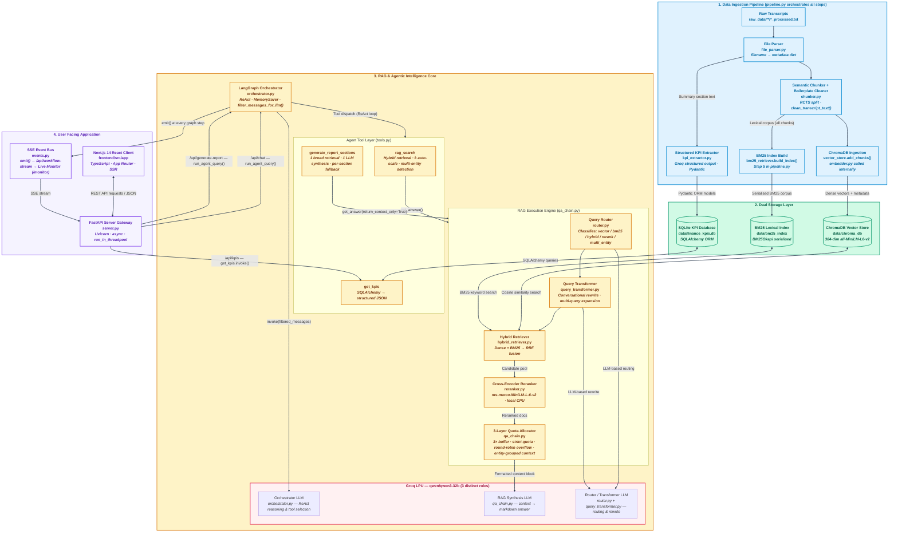

<div align="center">

# 📊 AURA — Financial Earnings Intelligence Platform

<!-- SEO Keywords: Multi-Agent RAG, LangGraph, FastAPI, Next.js, ChromaDB, Financial AI, Earnings Calls Analysis, Groq, Qwen3-32B, Llama-3.3-70B, Ollama, Local LLM, LangChain Ollama, Async KPI Backfill, HuggingFace, Reciprocal Rank Fusion, Cross-Encoder, AI Agent, SQLite, SQLAlchemy, Pydantic, asyncio, TypeScript, React, Active RAG, Self-Correction, Precision vs Recall Trade-off, Entity Starvation, LLM Primacy Bias, TailwindCSS, Financial Intelligence Platform, KPI Extraction, Earnings Intelligence, Structured Output -->

[](https://python.org)
[](https://nextjs.org)
[](https://www.typescriptlang.org/)
[](https://fastapi.tiangolo.com)
<br>
[](https://langchain-ai.github.io/langgraph/)
[](https://groq.com)
[](https://ollama.com)
[](https://huggingface.co)
<br>
[](https://trychroma.com/)
[](https://sqlite.org/)
[](https://docker.com)
[](LICENSE)

> **A precision-engineered, agentic RAG system that solves the hallucination and entity-starvation problems that break standard LLM pipelines — built for Apple, Microsoft & Nvidia earnings intelligence (Q1 2023 – Q4 2024)(Kaggle dataset).**

</div>

---

## 📺 Platform Preview

> A premium dark-luxury financial intelligence cockpit featuring AI chat, KPI analytics, and investment brief generation.


---

## 🌟 What Makes This a Production-Grade MVP

AURA transcends the typical "GenAI wrapper" by engineering robust, original solutions to the most critical failure modes in production financial AI — the same failure modes that affect LLM integrations at Bloomberg, Goldman Sachs, and large-scale enterprise RAG deployments:

- ⚖️ **Entity Starvation Elimination via 3-Layer Quota Allocation**: 

Standard RAG collapses for multi-company comparison queries, routing 12 chunks to Apple and 0 to Nvidia because the cross-encoder reranker scores based on signal density, not fairness. AURA's 3× per-entity retrieval buffer ensures each company enters the reranker with a rich candidate pool, a strict `k // n_entities` first-pass quota fills slots symmetrically, and a round-robin overflow mechanism distributes remaining budget cyclically — completely eliminating starvation.

- 🧠 **LLM Primacy Bias Mitigation via Entity-Grouped Context Ordering**: 

Even after retrieving equal chunks per company, standard LLMs still under-represent entities whose context appears at the *bottom* of the prompt. AURA counteracts this by regrouping the final context block by entity (all Apple → all Microsoft → all Nvidia), ensuring each company gets a coherent, contiguous reading window in the LLM's attention field.

- 🔗 **Two-LLM Synthesis Gap Resolution (Dual-Layer Prompt Enforcement)**: 

AURA uses two sequentially-called LLMs — an inner RAG chain LLM and an outer Agent Synthesiser LLM. A formatting rule in only one layer is silently overridden by the other. All quality rules (table generation, citation safety, equal entity coverage) are explicitly duplicated in both `prompts.py` and `server.py`, sealing the inter-LLM compliance gap.

- 🛡️ **Anti-Hallucination Stateful Memory Filter**: 

In multi-turn agentic systems, the LLM sees previous `ToolMessage` artifacts in history and "reuses" stale cached data instead of calling tools afresh — producing confident hallucinations. AURA's `filter_messages_for_llm()` actively strips all prior tool artifacts from the LangGraph state before each LLM call, forcing fresh data retrieval on every turn while preserving natural conversation flow.

- 🔁 **Active RAG (Recursive Self-Correction for Recall vs Precision)**: 

Static retrieval limits fail on deep narrative extraction. AURA implements dynamic `k` auto-boosting for forward-looking guidance queries, and exposes `k_override` directly to the orchestrator LLM. If the initial search yields sparse data, the agent actively self-reflects and recursively fetches deeper transcript chunks instead of passively failing.

- 🚦 **Agent Fallback Loophole Fixes**: 

LLM agents often halt execution when secondary tools return passive "no data found" strings. AURA transforms passive SQL failures into hard directives ("CRITICAL INSTRUCTION: You MUST immediately call the rag_search tool"), forcing the agent to seamlessly bridge structured DB misses with unstructured vector embeddings.

- 📊 **Table-Safe Citation Architecture**: 
The citation format `[Apple | Q3 | 2023 | summary]` contains `|` — the markdown table column separator. Embedding it in table cells destroys table structure by adding phantom columns.

- 🔀 **Scale-Invariant Hybrid Search with Adaptive Candidate Pool Scaling**: 

Standard RAG hardcodes candidate pool limits (e.g., `20`), causing the cross-encoder reranker to receive an insufficient pool when users request higher context richness. AURA dynamically scales the pool: `candidate_pool_limit = max(20, k + 10)`, ensuring the reranker always has a sufficiently rich pool regardless of the user's slider position.

- 🗄️ **Quantitative vs. Qualitative Routing (Dual-Store Architecture)**: 

LLMs hallucinate reported financial numbers when they're treated as plain text in vector embeddings. AURA routes all hard KPI queries (Revenue, EPS, Gross Margin) directly to a strict Pydantic-validated SQLite database, isolating quantitative extraction from vector search entirely and guaranteeing provably correct numerical answers.

- 🧹 **Domain-Specific Corpus Noise Elimination**: 

Earnings transcripts are polluted with Safe Harbor legal disclaimers, operator introductions, and call setup boilerplate — all of which contain high-frequency financial terms (`revenue`, `guidance`, `Apple`) that BM25 and cosine similarity both rank highly, injecting junk context into the LLM. AURA's `clean_transcript_text()` applies sentence-level pattern filtering during ingestion, eliminating 41 junk chunks (from 1,475 to 1,434) while retaining 100% of analytical content.

- 💡 **LLM Length-Scaling via Psychological Prompt Instruction**: 

LLMs naturally compress large context windows into broad summaries regardless of context volume. AURA engineers a prompt instruction that *tethers* response length to the quantity of incoming context: *"If you receive many source chunks, you MUST extract distinct insights from each and write a proportionally longer response."* — transforming the model from a "summariser" into a "detailed extractor" dynamically.

- ⚡ **Single-Retrieval Report Synthesis (5 RAG Calls → 1)**: 

The `generate_report_sections` tool originally made 5 sequential `rag_search` calls — one per report section — over the *same* underlying documents, paying the full hybrid retrieval + cross-encoder reranking + LLM generation cost 5× for every brief. The refactored design issues **one broad hybrid retrieval** (k=25) with a comprehensive multi-topic query, passes the shared 25-chunk evidence bundle to a **single LLM synthesis call** that writes all five sections simultaneously, and only triggers a targeted per-section fallback retrieval if the model explicitly flags `INSUFFICIENT_EVIDENCE`. This cut report latency from 30–60 seconds to **seconds**, eliminated cross-section numerical contradictions caused by independent LLM calls reasoning over slightly different chunk subsets, and surfaced all 25 unique source citations in a unified footer.

---

## 📑 Table of Contents

- [🌟 What Makes This a Production-Grade MVP](#-what-makes-this-a-production-grade-mvp)
- [📺 Platform Preview](#-platform-preview)
- [🛑 The Enterprise Information Bottleneck](#-the-enterprise-information-bottleneck)
- [📥 Quick Start](#-quick-start)
- [✨ Features](#-features)
- [🏗️ Architecture](#️-architecture)
- [📚 Documentation](#-documentation)
- [🛠️ Tech Stack](#️-tech-stack)
- [🚀 Deployment](#️-deployment)
- [📈 Phase Changelog](#-phase-changelog)
- [💡 Engineering Highlights](#-engineering-highlights)
- [📁 Project Structure](#-project-structure)

---

## 🛑 The Enterprise Information Bottleneck

**The Problem:** Financial analysts and hedge funds drown in information overload during earnings season. When trying to use standard LLMs to automate research, two critical failure modes emerge:

- 🔴 **LLM Hallucination** — Models confidently fabricate revenue figures, EPS values, and guidance numbers that never appeared in any transcript.
- 🔴 **Entity Starvation** — When asked to compare Apple, Microsoft, and Nvidia simultaneously, standard RAG pipelines return 12 Apple chunks, 3 Microsoft chunks, and 0 Nvidia chunks — producing a dangerously biased analysis.

**The Solution:** AURA was engineered specifically to eliminate both failure modes. A **Multi-Agent RAG Architecture** isolates qualitative analysis (Hybrid RAG + Cross-Encoders) from quantitative extraction (strict SQLite KPI database), while a custom 3-Layer Quota Allocator guarantees equal, unbiased context representation for every company.

👉 **[Read the Full Problem Statement & Market Value Here](docs/problem_statement.md)**

---

## 📥 Quick Start

**Prerequisites:** Python 3.11+, Node.js 20, a free [Groq API key](https://console.groq.com/)

```bash
# 1. Clone & configure
git clone <your-repo-url> && cd Finance_RAG_Project
echo "GROQ_API_KEY=gsk_your_key_here" > config/.env

# 2. Install Python dependencies
pip install -r requirements.txt

# 3. Run data ingestion (~2–4 min, one-time)
python -m src.ingestion.pipeline

# 4. Start backend API
python -m src.api.server

# 5. Start frontend (new terminal)
cd frontend && npm install && npm run dev
```

🌐 Open [http://localhost:3000](http://localhost:3000)

> **Prefer Docker?** → [One-command deployment](#docker-compose-one-command)

---

## ✨ Features

### 🔍 Hybrid Retrieval Engine

- **Dual-index search**: Dense vector (ChromaDB + `all-MiniLM-L6-v2`) + sparse keyword (BM25Okapi) running in parallel
- **Reciprocal Rank Fusion**: Merges ranked candidate lists without score normalization — scale-invariant and consistently outperforms linear combination
- **Cross-Encoder Reranking**: Local `ms-marco-MiniLM-L-6-v2` scores `(query, passage)` pairs at deep interaction level

### 🤖 Multi-Agent Orchestration

AURA divides cognitive labor among specialized, autonomous sub-systems rather than relying on a single prompt:

- **The Orchestrator Agent (Manager)**: The LangGraph state machine using the ReAct paradigm to reason and route queries to specialized tool agents.
- **The Research Agent (`rag_search`)**: Handles qualitative data. It uses its own Query Router, Query Transformer, and a dedicated Synthesis LLM to format markdown tables and enforce citation rules independently of the Manager.
- **The Data Analyst Agent (`get_kpis`)**: Interacts directly with the SQLite database via Pydantic-validated Groq structured outputs to fetch precise quantitative metrics without hallucination.
- **The Writer Agent (`generate_report_sections`)**: Coordinates with both the Research and Analyst agents to synthesize comprehensive investment briefs.
- **Anti-Hallucination History Filter**: Strips past `ToolMessage` artifacts from the shared state memory before each LLM call to ensure fresh tool invocations.

### ⚖️ Fair Multi-Entity RAG

- **Strict quota allocation**: Guarantees `k // n_companies` document slots per company — prevents entity starvation
- **3× retrieval buffer**: Fetches `exact_per_entity × 3` candidates per entity before reranking
- **Round-robin overflow fill**: Remaining budget allocated cyclically across all companies
- **Entity-grouped context**: Apple → MSFT → Nvidia ordering combats LLM primacy bias

### 📊 Structured KPI Intelligence

- **Groq structured output**: Extracts Revenue, EPS, Gross Margin, Guidance, Net Income via Pydantic-validated LLM calls
- **SQLite database**: `data/finance_kpis.db` stores all structured metrics for instant query
- **KPI Analytics Dashboard**: YoY chevron indicators, quarterly metric cards, company selector

### 💅 Premium Cockpit UI

- **Three-panel interface**: Intelligence Chat · KPI Analytics · Investment Brief Generator
- **Live Agent Workflow Monitor**: Dedicated React Flow observability page (`/monitor`) streaming agent execution via SSE
- **Animated sun icon**: 8s idle spin → 3s active spin + expanding pulse halo when typing
- **Citation bubble tooltips**: Hover any `[Company | Q | Year | Section]` reference for source snippet
- **Markdown comparison tables**: Enforced via dual-layer prompt engineering for multi-entity queries
- **Response Richness slider**: 1–30 references; auto-scaled internally for multi-entity queries

---

## 🏗️ Architecture

The platform is built as four sequential layers:



> 🖼️ **HD Visual Overview** — High-definition mindmaps of the full system and detailed RAG pipeline (exported from Eraser.io):

| System Architecture Mindmap | Detailed RAG Architecture Mindmap |
|:---:|:---:|
|  |  |

📖 **[Read the full Architecture Deep-Dive →](docs/architecture.md)**

---

## 🛠️ Deployment

### Local Development

See the [Quick Start](#-quick-start) section above.

### Docker Compose (One-Command)

```bash
# Ensure Docker Desktop is running
docker compose up --build
```

- First build: ~10–20 minutes (PyTorch + HuggingFace model downloads)
- Subsequent starts: <10 seconds (Docker layer cache)
- Open [http://localhost:3000](http://localhost:3000)

**Run ingestion inside Docker** (first-time only if `data/` is empty):
```bash
docker compose run --rm backend python -m src.ingestion.pipeline
```

📖 **[Full Deployment Guide →](docs/deployment.md)**

---

## 🚀 Future Scalability Path

While AURA currently uses SQLite and local ChromaDB for zero-friction local deployment and ease of demonstration, it is architecturally prepared for migration. For enterprise production serving thousands of concurrent users, the system is designed to scale with:
- **PostgreSQL** for strict KPI storage and ACID compliance.
- **Qdrant** or **Pinecone** for distributed vector search.
- **Redis** for caching LangGraph state and conversational history.

---

## 📚 Documentation

Explore the detailed technical documentation in the [`docs/`](docs/) directory:

| Document | Description |
|---|---|
| 📐 [Architecture Deep-Dive](docs/architecture.md) | Full system design: all 4 layers, design decisions, data flows |
| 🔍 [Retrieval Engine](docs/retrieval_engine.md) | BM25, RRF, Cross-Encoder, Query Router, multi-entity quota algorithm |
| 🤖 [Agent Orchestration](docs/agent_orchestration.md) | LangGraph state machine, tools, memory, prompt engineering |
| 💅 [Frontend Cockpit](docs/frontend.md) | Next.js design system, components, animations, API integration |
| 🚀 [Deployment Guide](docs/deployment.md) | Local setup, Docker, troubleshooting, performance tuning |
| 🛠️ [Engineering Challenges](docs/engineering_challenges.md) | All-phases challenge log: root causes, solutions, learnings |
| 📊 [Evaluation Report](evaluation/results/eval_report.md) | Phase 2 & Phase 7 RAG quality metrics, entity fairness, hallucination tests |

**Per-Phase Engineering Logs:**

| Phase | Focus | Document |
|---|---|---|
| 1 | RAG Foundation | [Phase 1 →](features_and_learnings/Phase_1challenges_and_learnings.md) |
| 2 | Hybrid Retrieval | [Phase 2 →](features_and_learnings/phase2_challenges_and_solutions.md) |
| 3–4 | KPI Extraction + Agent | [Phase 3–4 →](features_and_learnings/phase3_4__challenges_and_resolutions.md) |
| 5 | Premium Frontend | [Phase 5 →](features_and_learnings/phase5_challenges_and_solutions.md) |
| 6 | Dockerization | [Phase 6 →](features_and_learnings/phase6_challenges_and_solutions.md) |
| 7 | RAG Quality | [Phase 7 →](features_and_learnings/phase7_challenges_and_solutions.md) |
| 8 | Workflow Monitor | [Phase 8 →](features_and_learnings/phase8_challenges_and_solutions.md) |
| 9 | KPI Backfill | [Phase 9 →](features_and_learnings/Phase_9_Challenges_and_solutions.md) |

**Master Walkthrough:** [walkthrough.md →](walkthrough.md)

---

## 🧰 Tech Stack

| Layer | Technology | Purpose |
|---|---|---|
| **LLM Inference** | Groq LPU + `qwen/qwen3-32b` | ~500 tok/s deterministic generation |
| **Agent Framework** | LangGraph 0.2+ | Stateful cyclic tool-calling graph |
| **Vector Store** | ChromaDB | Local persistent dense embedding index |
| **Sparse Retrieval** | BM25Okapi | Exact keyword and ticker matching |
| **Embeddings** | `all-MiniLM-L6-v2` | 384-dim local embeddings, zero API cost |
| **Reranker** | `ms-marco-MiniLM-L-6-v2` | Local cross-encoder passage reranking |
| **KPI Database** | SQLite + SQLAlchemy | Structured financial metrics ORM |
| **Backend API** | FastAPI + Uvicorn | Async streaming JSON endpoints |
| **Frontend** | Next.js 14 + TypeScript | App Router, SSR, React 18 |
| **Markdown** | react-markdown + remark-gfm | Tables, citations, code rendering |
| **Containerization** | Docker + Docker Compose | Multi-stage builds, bridge networking |

---

## 📈 Phase Changelog

| Phase | Focus | Key Deliverables |
|---|---|---|
| **1 — RAG Foundation** | Core pipeline | ChromaDB ingestion, `<think>` token filter, Streamlit UI, Qwen3 integration |
| **2 — Hybrid Retrieval** | Retrieval quality | BM25 index, RRF fusion, cross-encoder reranker, entity starvation fix v1 |
| **3 — KPI Extraction** | Structured data | Groq structured output, Pydantic ORM, SQLite schema, KPI dashboard |
| **4 — Agent Orchestration** | Agentic loop | LangGraph state machine, MemorySaver, multi-turn history filter |
| **5 — Premium Frontend** | UI overhaul | Next.js cockpit, citation bubbles, query history, agent stepper |
| **6 — Dockerization** | Production ops | Multi-stage Docker, Compose networking, volume persistence |
| **7 — RAG Quality** | Intelligence accuracy | 3× buffer retrieval, round-robin overflow, entity-grouped context, table citation safety, dual-layer prompts |
| **8 — Workflow Monitor** | Observability | Live React Flow graph, SSE event bus, async threadpool unblocking, auto-retry parser |
| **9 — KPI Backfill** | Data completeness | Async Ollama backfill script, single-pass `AllKPIs` schema, composite DB key fix, `langchain-ollama` migration |

---

## 💡 Engineering Highlights

Building a production-grade AI system requires moving beyond simple API wrappers to solve the edge-case challenges that break standard implementations. This section outlines the core architectural hurdles encountered while building AURA, and the specific engineering solutions developed to guarantee enterprise-level reliability, fairness, and zero-hallucination accuracy.

📄 **Handling Single-Line Transcripts**

Source files are 40–60KB single-line blobs. The chunker splits at the `[ ` section boundary marker first, then applies sentence-priority RCTS separators (`. ` → `? ` → `! ` → `; `) to preserve financial figure context across chunk boundaries.

⚖️ **Preventing Company Starvation**

For *"Compare risks across Apple, Microsoft, Nvidia"* — naive retrieval returns 12 Apple chunks, 3 Microsoft, 0 Nvidia. The fix: **3× per-entity retrieval buffer → per-entity reranking → strict quota allocation → round-robin overflow fill → entity-grouped context ordering.**

🔗 **Two-LLM Synthesis Gap**

The inner RAG LLM and outer agent synthesis LLM are independently instructed. All formatting rules (table generation, citation safety, equal entity coverage) are duplicated at both `prompts.py` and `server.py` — rules at only one layer are silently overridden by the other.

📊 **Table-Safe Citations**

`[Apple | Q3 | 2023 | summary]` contains `|` which markdown renders as table column separators. Inside table cells, the system uses `[1]`, `[2]` numeric refs with a Citation Key section below — enforced via both prompt layers.

📈 **Auto-Scaling K for Multi-Entity Queries**

`k=6` with 3 companies gives 2 chunks per company — critically sparse for fair coverage. The agent auto-scales dynamically: `effective_k = min(24, max(GLOBAL_K, n_entities × 6))`.

📖 **[See all engineering challenges →](docs/engineering_challenges.md)**

---

## 📂 Project Structure

```
Finance_RAG_Project/
├── src/                        # Python backend modules
│   ├── ingestion/              # Transcript parsing & indexing pipeline
│   ├── retrieval/              # Vector, BM25, RRF, reranker, router
│   ├── generation/             # Prompts, RAG chain, quota allocation
│   ├── extraction/             # KPI extractor, SQLite ORM schema, backfill_kpis.py
│   ├── agents/                 # LangGraph tools & orchestrator
│   └── api/                    # FastAPI server & system instructions
├── frontend/                   # Next.js 14 premium cockpit UI
│   └── src/app/                # page.tsx, layout.tsx, globals.css
├── docs/                       # 📚 Detailed technical documentation
│   ├── architecture.md         # System design overview
│   ├── retrieval_engine.md     # Retrieval deep-dive
│   ├── agent_orchestration.md  # LangGraph agent reference
│   ├── frontend.md             # UI component documentation
│   ├── deployment.md           # Setup & deployment guide
│   └── engineering_challenges.md  # All-phases challenge log
├── Important_HD_Flowcharts/    # 🖼️ HD Eraser.io mindmap exports
│   ├── System_Architecture_MIndmap.png
│   ├── Data_Ingestion_Pipeline.png
│   ├── Detailed_RAG_Arhitecture_Mindmap.png
│   └── AI_Agent_Workflow_LangGraph_Structure.png
├── features_and_learnings/     # Per-phase engineering logs (Phases 1–9)
├── config/
│   ├── config.yaml             # All system parameters (models, paths, thresholds)
│   └── .env                    # GROQ_API_KEY (gitignored)
├── data/                       # Generated at ingestion (gitignored)
│   ├── chroma_db/              # ChromaDB vector store
│   ├── bm25_index/             # Serialized BM25 corpus
│   └── finance_kpis.db         # SQLite KPI database
├── backend.Dockerfile          # Python container
├── docker-compose.yml          # Full-stack orchestration
└── requirements.txt            # Python dependencies
```

---

## 🤝 Contributing

Contributions are welcome — whether it's extending the dataset to more companies, adding new retrieval strategies, improving the frontend, or writing evaluation benchmarks.

1. Fork the repository
2. Create your feature branch: `git checkout -b feature/your-feature`
3. Commit your changes: `git commit -m 'Add your feature'`
4. Push to branch: `git push origin feature/your-feature`
5. Open a Pull Request

---

## 📄 License

This project is licensed under the **MIT License**.

---

## ⚠️ Disclaimer

> **This project is for educational and research purposes only.**

AURA is an academic demonstration of Multi-Agent Retrieval-Augmented Generation (RAG) techniques applied to publicly available earnings call transcript data. The investment research briefs, KPI summaries, financial analyses, and any other outputs generated by this platform **do not constitute financial advice, investment recommendations, or solicitations to buy or sell any securities**.

- All data is sourced from publicly available earnings call transcripts (Kaggle dataset).
- Generated reports are AI-synthesized summaries and may contain inaccuracies or omissions.
- Past financial performance discussed in transcripts is not indicative of future results.
- Always consult a qualified financial professional before making any investment decisions.

---

## 🙏 Acknowledgments

- [Groq](https://groq.com/) — LPU inference infrastructure enabling ~500 tok/s generation
- [LangGraph](https://langchain-ai.github.io/langgraph/) — Stateful agent graph compilation
- [ChromaDB](https://www.trychroma.com/) — Local vector store with metadata filtering
- [Sentence Transformers](https://www.sbert.net/) — `all-MiniLM-L6-v2` embeddings & `ms-marco-MiniLM-L-6-v2` reranker
- The base Financial transcripts were sourced from the Kaggle dataset: 
  [Earning Call Transcripts (2023-2024)](https://www.kaggle.com/datasets/ramssvimala/earning-call-transcripts)

---

<div align="center">

**Nine phases of iteration. One mission: financial intelligence without hallucination.**

[Documentation](docs/) • [Walkthrough](walkthrough.md) • [Engineering Logs](features_and_learnings/) • [Detailed RAG Architecture](docs/detailed_rag_architecture.md)

</div>
