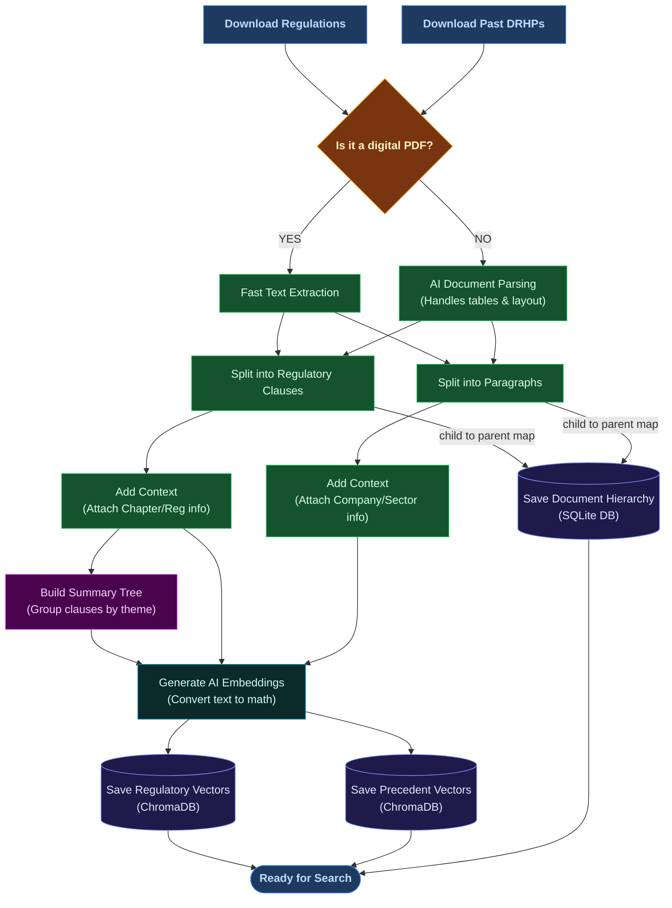
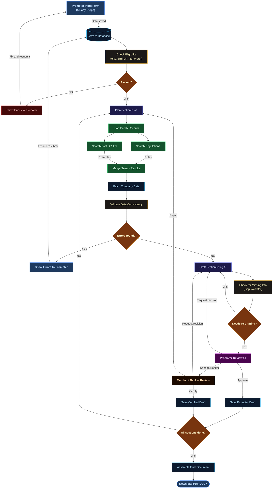
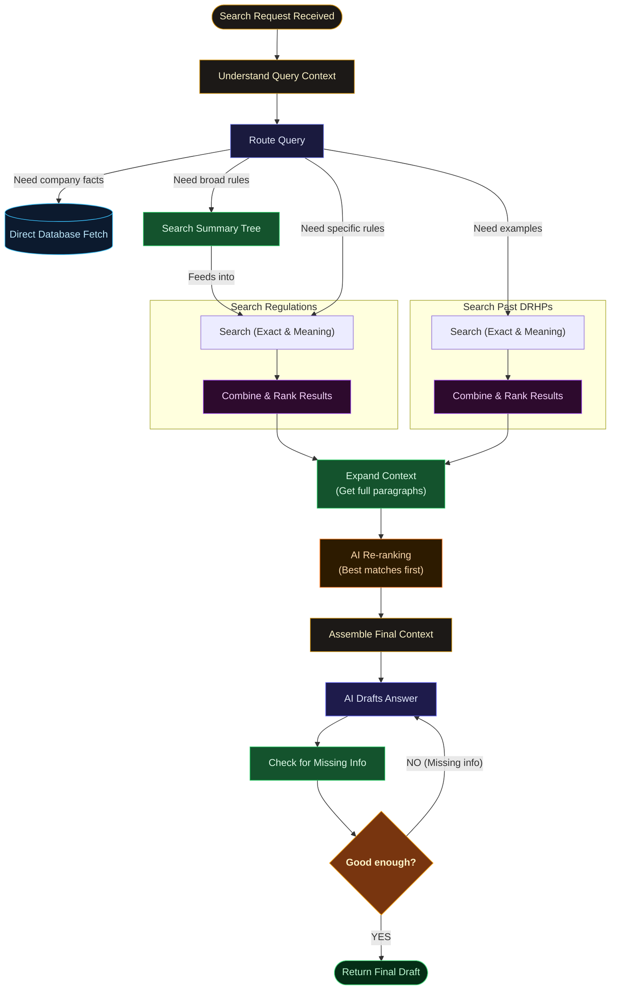

# PS04 Alignment Analysis + Architecture Diagrams
## SEBI SME IPO Offer Document Generator

---

## 1. PS04 Re-Analysis — What the Problem ACTUALLY Demands

| # | PS04 Requirement | Verbatim Quote |
|---|---|---|
| **R1** | Guided data capture | *"enables an SME promoter to capture their business, financial, and legal particulars"* |
| **R2** | Complete draft generation | *"generate a well-organised, disclosure-ready draft offer document"* |
| **R3** | Accessible to non-experts | *"simple enough for a first-time issuer to engage with"* |
| **R4** | Gap/consistency flagging | *"flag gaps or inconsistencies in the information provided"* |
| **R5** | Intermediary role preserved | *"preserve the role of authorised intermediaries in review and certification"* |

| # | PS04 Desired Outcome | What it implies |
|---|---|---|
| **O1** | Substantially complete draft | Full sections with real language, not just a skeleton |
| **O2** | All material disclosure requirements | All ~25 SEBI-mandated DRHP sections, not cherry-picked |
| **O3** | Flag gaps AND inconsistencies | Missing data (gap) and contradictory data (inconsistency) are separate problems |
| **O4** | Broaden SME pipeline | UX operable by a promoter with zero capital market experience |

---

## 2. Alignment Audit — v2 Plan vs PS04

### ✅ Well-Aligned

| PS04 | v2 Coverage | Status |
|---|---|---|
| R2 — Draft generation | LangGraph: planner → parallel retrieval → draft_generation_node | ✅ Excellent |
| R4 — Gap flagging | `flag_gaps` tool + GAP markers + `completeness_score` | ✅ Excellent |
| R5 — Intermediary gate | HITL `interrupt()` + `status` enum with `intermediary_certified` | ✅ Excellent |
| O1 — Complete draft | RAPTOR + dual-corpus retrieval grounded in regulation + precedent | ✅ Strong |

### ⚠️ Partially Aligned

| PS04 | Gap | Severity |
|---|---|---|
| R1 — Guided capture | Schema has `promoter_input` but no wizard / form flow specified | 🔴 Critical |
| R3 — Non-expert UX | `explain_gap_to_promoter()` exists for gaps but no input-time guidance | 🟡 Moderate |
| O3 — Inconsistency | Gap detection (missing data) done; inconsistency (contradictory data) absent | 🟡 Moderate |
| O2 — All sections | Demo covers ~9 sections; SEBI mandates ~25 DRHP sections | 🟡 Moderate |

### ❌ Missing Entirely

| Gap | Impact |
|---|---|
| Promoter Input Wizard | R1 is PS04's first stated goal — no wizard means no product entry point |
| DRHP Section Coverage Map | Judges will ask: "Does this cover Basis of Issue Price? Statutory Disclosures?" |
| Inconsistency Engine | PS04 explicitly says "gaps **or inconsistencies**" — plan only handles gaps |
| Document Export | "Draft offer document" implies a downloadable file, not just screen text |
| Section Assembly / TOC | Sections must be stitched in SEBI-mandated order into one coherent document |

---

## 3. Proposed Upgrades

| Priority | Upgrade | PS04 Requirement |
|---|---|---|
| 🔴 P1 | **Promoter Input Wizard** — 5-step guided form + CIN autofill via Sandbox MCA API | R1, R3 |
| 🔴 P1 | **Inconsistency Detection Engine** — `consistency_validator_node` before drafting | O3 |
| 🟡 P2 | **Merchant Banker Review Node** — separate HITL gate for intermediary certification | R5 |
| 🟡 P2 | **Full 25-Section Coverage Map** — all mandatory sections with ICDR references | O2 |
| 🟡 P2 | **Document Assembler + Export** — `document_assembler_node`, DOCX + PDF output | O1 |
| 🟢 P3 | **Plain-English Gap Explanations** — wire `explain_gap_to_promoter` to frontend | R3 |
| 🟢 P3 | **Live CIN Autofill** — Sandbox.co.in MCA API for one live demo round-trip | Demo impact |

---

## 4. RAG Ingestion Pipeline

> **Phase:** Offline, one-time. Runs before any user query. Produces two ChromaDB collections, a RAPTOR regulatory tree, and a SQLite parent-doc store.

### Explanation of Workflow:
This pipeline is responsible for reading the raw documents (SEBI regulations and past DRHPs) and converting them into a format the AI can easily search. 
1. **Document Download:** The system pulls down the latest SEBI regulations and examples of successful past IPO filings.
2. **Parsing:** It checks if the document is a simple text PDF or a complex layout with tables. Simple PDFs are extracted quickly, while complex ones are processed using a machine learning pipeline (Docling) to preserve the structure.
3. **Chunking & Context:** The documents are broken down into small, digestible pieces (chunks). To make sure these pieces don't lose their meaning, we attach "breadcrumbs" (like the chapter and regulation number) to each chunk.
4. **Summary Tree (RAPTOR):** For regulations, we build a "summary tree". This groups individual rules into broader topics, making it easier for the AI to understand high-level concepts.
5. **AI Embeddings & Storage:** All chunks and summaries are converted into mathematical vectors (embeddings) and stored in our database (ChromaDB), ready to be searched.

---

## 5. Full Agent Workflow — Wizard to Document

> **Phase:** Runtime, per user session. Covers the complete journey from data entry through HITL review, merchant banker certification, and final document export.

### Explanation of Workflow:
This is the core loop that the Promoter (the user) interacts with.
1. **Promoter Input:** The promoter answers a simple step-by-step form to provide their company's details, financials, and management info.
2. **Eligibility & Validation:** The system first checks if the company is legally allowed to do an IPO (e.g., they meet the revenue threshold). If they pass, the AI plans out the DRHP section by section.
3. **Data Gathering:** For each section, the AI searches our databases for the required SEBI rules AND examples of how other companies wrote this section. It also pulls the specific facts the promoter provided.
4. **Consistency Check:** Before writing, the AI makes sure the promoter's math makes sense (e.g. shares × price = total issue size). If not, it asks the promoter to fix it.
5. **Drafting & Gap Check:** The AI writes the draft section. Then, a second "checker" AI reads the draft to make sure no mandatory SEBI rules were forgotten.
6. **Review (HITL):** The promoter reviews the drafted section. They can approve it, edit it, or send it to their Merchant Banker for official certification.
7. **Document Assembly:** Once all ~25 sections are drafted and approved, the system stitches them together into a final, downloadable Word/PDF document.

---

## 6. RAG Online Query Pipeline

> **Phase:** Runtime, called inside `regulatory_retrieval_node` and `precedent_retrieval_node` on every section draft. Also invoked standalone for eligibility checks and gap detection.

### Explanation of Workflow:
This diagram explains what happens "under the hood" when the AI searches for information.
1. **Query Processing:** The AI receives a search request, understands the context (e.g. resolving pronouns like "it" based on previous chat), and decides which database to search.
2. **Smart Searching:** Depending on the need, the AI might fetch facts directly from the database, search the high-level summary tree, or perform deep searches across both regulations and past DRHPs simultaneously.
3. **Combining & Re-ranking:** Because it searches using both exact keywords AND semantic meaning, it combines the results. Then, it uses a fast AI "re-ranker" to sort the results so the most relevant information is at the top.
4. **Context Expansion:** If the AI finds a relevant sentence, it pulls the surrounding paragraph to ensure it has full context and doesn't misinterpret the rule.
5. **Final Check & Output:** The AI uses the final collected context to draft the answer, then verifies its own work against the SEBI checklist to ensure no details were missed before handing it back to the main workflow.

---

## 7. Summary — What v2 Gets Right + What to Add

### Keep from v2

| Decision | Why It's Right |
|---|---|
| **BGE-M3 triple-mode** | One model replaces separate BM25 + vector pipeline — three retrieval signals, one forward pass |
| **RAPTOR regulatory tree** | Multi-hop queries like "what does Risk Factors need?" need tree-level retrieval, not flat clause search |
| **Parallel LangGraph nodes** | Regulatory + precedent retrieved simultaneously — halves per-section latency |
| **HITL `interrupt()`** | Clean pause-and-resume gate — directly solves PS04 R5 |
| **Dual-LLM strategy** | Groq speed for streaming drafts; Gemini 1M context for full-PDF structured extraction |
| **Contextual Retrieval enrichment** | Breadcrumb prepend at ingestion time — zero query-time cost, measurable precision improvement |
| **Two-layer prompt enforcement** | Citation rules and GAP preservation must live in both `prompts.py` AND `server.py` |

### Add to v2

| Priority | Addition | PS04 Requirement |
|---|---|---|
| 🔴 P1 | **Promoter Input Wizard** — 5-step guided form, CIN autofill, plain-English field tooltips | R1, R3 |
| 🔴 P1 | **Inconsistency Engine** — `consistency_validator_node`, arithmetic and format cross-checks | O3 |
| 🟡 P2 | **Merchant Banker Review Node** — separate HITL with CERTIFY / REVISE / REJECT branches | R5 |
| 🟡 P2 | **25-Section DRHP Coverage Map** — all mandatory sections with ICDR refs and thresholds | O2 |
| 🟡 P2 | **Document Assembler and Export** — DOCX and PDF in SEBI TOC order | O1 |
| 🟢 P3 | **Plain-English Gap Explanations** — `explain_gap_to_promoter` wired to frontend | R3 |
| 🟢 P3 | **Live MCA CIN Autofill** — Sandbox.co.in free-tier API for demo round-trip | Demo impact |
